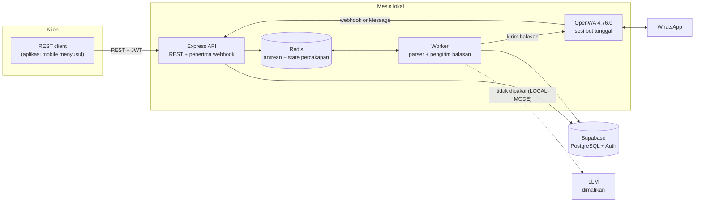
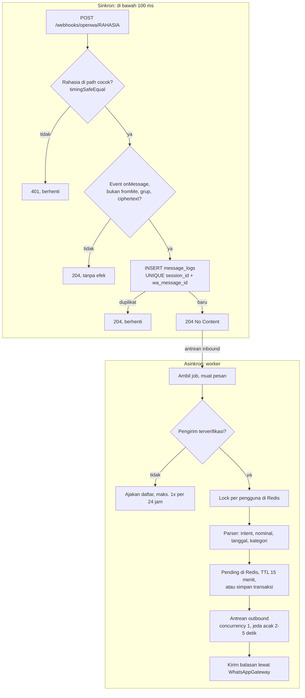

# Cashify Backend

Cashify adalah API keuangan pribadi dengan dua kanal masuk ke satu sistem yang sama: aplikasi mobile lewat REST, dan WhatsApp lewat webhook OpenWA. Pengguna mengirim pesan seperti `tadi makan siang 25 ribu` ke nomor bot; sistem membaca nominal dan tanggalnya dengan regex, mencocokkan kategori lewat kamus kata kunci, meminta konfirmasi lewat chat, lalu menyimpan transaksinya setelah pengguna membalas `ya`. Kalau pesannya kurang jelas (`keluar 50 ribu`), bot bertanya, bukan menebak. Nominal dan tanggal tidak pernah ditentukan model bahasa, dan LLM dimatikan secara default. Proyek kuliah: seluruh layanan gratis dan berjalan di lokal (Node.js 22, TypeScript, Express, Prisma, Supabase, Redis, BullMQ, OpenWA). Batasan lengkapnya ada di [claude/LOCAL-MODE.md](claude/LOCAL-MODE.md).

Skenario demo langkah demi langkah: [claude/DEMO-SCRIPT.md](claude/DEMO-SCRIPT.md).

## Arsitektur

OpenWA bukan lapisan data, melainkan adaptor kanal yang setara dengan aplikasi mobile. Setiap penulisan, dari kanal mana pun, bertemu di Express. Aplikasi mobile belum dibangun; koleksi REST client di [rest/](rest/) berperan sebagai konsumennya.



Webhook dipotong menjadi dua fase supaya pemrosesan yang lambat tidak pernah menahan respons HTTP, dan supaya kiriman ulang dari OpenWA (yang bersifat at-least-once) tidak menggandakan apa pun:



Bentuk webhook yang berlaku adalah hasil rekaman OpenWA v4 nyata, bukan yang digambarkan blueprint: lihat bagian "Webhook OpenWA v4" di [claude/LOCAL-MODE.md](claude/LOCAL-MODE.md).

### Aturan yang menjaga rancangan

| Aturan | Di mana terlihat |
| --- | --- |
| Uang adalah bilangan bulat rupiah (`Int`) | `prisma/schema.prisma`, `src/shared/utils/money.ts` |
| Nominal dan tanggal dari regex, bukan LLM | `src/parsers/` (fungsi murni, tanpa impor modul lain) |
| Balasan dari template, bukan teks LLM | `src/modules/whatsapp/whatsapp.templates.ts` |
| Webhook cepat, tanpa service | `src/modules/webhooks/webhooks.controller.ts` |
| Idempotency di database | unique `(session_id, wa_message_id)` pada `message_logs` |
| `fromMe` dan grup diabaikan | `classify()` di `webhooks.controller.ts` |
| `user_id` selalu dari JWT, semua kueri difilter | `src/shared/utils/userScope.ts` (`ownedBy`, `visibleTo`) |
| WhatsApp hanya lewat gateway | `src/gateways/whatsapp/` |
| Antrean `outbound` concurrency 1, jeda 2-5 detik | `src/queues/outbound.queue.ts`, `src/workers/outbound.worker.ts` |
| Skema hanya lewat `prisma migrate` | `prisma/migrations/` |

## Prasyarat

- Node.js 22+
- Docker (hanya untuk Redis, dan Postgres khusus test)
- Proyek Supabase free tier (Postgres + Auth)
- Satu nomor WhatsApp cadangan untuk bot (jangan nomor pribadi: ada risiko diblokir)
- VS Code dengan ekstensi REST Client (humao) untuk memakai [rest/](rest/)

## Menjalankan dari nol

```bash
npm install
cp .env.example .env              # isi semua nilainya (lihat tabel di bawah); aplikasi menolak boot bila ada yang kosong
docker compose up -d redis        # Redis saja; Postgres ada di Supabase
npx prisma migrate deploy         # terapkan migrasi ke Supabase (pakai DIRECT_URL)
npm run seed                      # kategori sistem + pengguna demo
npm run dev                       # API di http://127.0.0.1:3000
npm run dev:worker                # worker, terminal terpisah, SATU instance saja
```

Periksa:

```bash
curl http://127.0.0.1:3000/health
```

Dokumentasi interaktif (Swagger UI) ada di `http://127.0.0.1:3000/api-docs`; spesifikasi mentahnya di `/api-docs.json`, atau diekspor dengan `npm run openapi` ke `claude/openapi.json`.

### OpenWA (kanal WhatsApp)

OpenWA berjalan di mesin yang sama dengan Express, jadi **webhook tidak butuh tunnel**. Versi 4.76.0 tidak bisa memuat WhatsApp Web tanpa tambalan user agent, dan flag `--custom-user-agent` diabaikan di luar Docker, jadi OpenWA dijalankan dari folder `spike/` yang memuat tambalannya (`spike/src/ua-preload.cjs`):

```bash
cd spike
npm install
node -r ./src/ua-preload.cjs node_modules/@open-wa/wa-automate/bin/server.js \
  -p 8002 -k <OPENWA_API_KEY> --session-id <OPENWA_SESSION_ID> \
  -w http://localhost:3000/webhooks/openwa/<WEBHOOK_SECRET> --use-chrome
```

Ganti ketiga placeholder dengan nilai yang sama di `.env`. **Sudah pernah memindai QR di `spike/`?** Login WhatsApp tersimpan di profil browser `spike/_IGNORE_<session-id>`, jadi tidak perlu memindai ulang selama nama sesinya sama. Spike memakai sesi bawaan `session`: jalankan tanpa flag `--session-id` dan setel `OPENWA_SESSION_ID=session` di `.env`. Nama sesi lain berarti profil baru dan QR baru. Jangan jalankan dua instance OpenWA pada sesi yang sama. QR muncul di terminal: di HP nomor bot, buka WhatsApp, Perangkat tertaut, Tautkan perangkat, lalu pindai. Tunggu log OpenWA menyatakan klien siap.

OpenWA v4 tidak bisa mengirim header kustom, jadi rahasia webhook ada di path (huruf, angka, `-`, `_`). Webhook hanya memproses `onMessage`; event lain, pesan grup, dan pesan bot sendiri dibalas `204` tanpa efek.

## Variabel lingkungan

Semua dibaca dan divalidasi Zod di [src/config/env.ts](src/config/env.ts) saat boot. Berkas contoh: [.env.example](.env.example). Jangan mengosongkan variabel (`NODE_ENV=` menghasilkan string kosong dan membuat validasi gagal); hapus barisnya bila ingin nilai bawaan.

| Variabel | Wajib | Bawaan | Cara mendapatkan |
| --- | --- | --- | --- |
| `NODE_ENV` | tidak | `development` | `development`, `test`, atau `production`. Log berwarna (pino-pretty) hanya di `development` |
| `PORT` | tidak | `3000` | |
| `HOST` | tidak | `127.0.0.1` | Biarkan; mengikat ke loopback berarti tidak ada permukaan serang jaringan |
| `LOG_LEVEL` | tidak | `info` | `fatal`, `error`, `warn`, `info`, `debug`, `trace`, `silent` |
| `DATABASE_URL` | ya | | Supabase: Project Settings, Database, Connection string, mode **pooler** (port 6543, tambahkan `?pgbouncer=true`). Karakter khusus di password di-URL-encode (`@` menjadi `%40`) |
| `DIRECT_URL` | ya | | Connection string **langsung** (port 5432). Hanya dipakai migrasi |
| `REDIS_URL` | ya | | `redis://localhost:6379` dari `docker compose up -d redis` |
| `SUPABASE_URL` | ya | | Project Settings, API, Project URL |
| `SUPABASE_ANON_KEY` | ya | | Project Settings, API, kunci `anon` |
| `SUPABASE_SERVICE_ROLE_KEY` | ya | | Project Settings, API, kunci `service_role`. Rahasia: jangan di-commit, jangan dikirim ke klien |
| `SUPABASE_JWT_SECRET` | ya | | Project Settings, API (JWT Settings), JWT secret |
| `OPENWA_URL` | ya | | `http://localhost:8002` (port flag `-p` OpenWA) |
| `OPENWA_API_KEY` | ya | | Karang sendiri; nilai yang sama dipakai di flag `-k` OpenWA |
| `OPENWA_SESSION_ID` | tidak | `myfinance-bot` | Nilai yang sama dengan flag `--session-id` OpenWA; dipakai mencatat status bot |
| `WEBHOOK_SECRET` | ya | | Minimal 16 karakter `[A-Za-z0-9_-]`. Buat dengan `openssl rand -hex 24`. Menjadi segmen path webhook |
| `LLM_PROVIDER` | tidak | `disabled` | Satu-satunya nilai yang valid saat ini: `disabled` |
| `LLM_API_KEY` | tidak | | Tidak dipakai selama LLM dimatikan |
| `TEST_DATABASE_URL` | tidak | `localhost:54329` | Hanya untuk test integrasi. Harus `localhost`/`127.0.0.1`: test menghapus isi tabel |
| `TEST_REDIS_URL` | tidak | `localhost:6379` | Hanya untuk test yang butuh Redis |
| `DEMO_EMAIL`, `DEMO_PASSWORD` | tidak | lihat di bawah | Hanya dibaca `npm run seed`; ganti bila Supabase menolak domain email bawaan |

Supabase juga perlu dikonfigurasi satu kali: **matikan konfirmasi email** (Authentication, Providers, Email), karena `/auth/register` dan seed demo mengharapkan sesi langsung terbit.

## Data demo dan kredensial

`npm run seed` membuat satu pengguna demo lewat Supabase Auth, supaya dashboard dan layar detail bisa diuji tanpa mengetik data. Butuh jaringan dan `SUPABASE_URL`, `SUPABASE_ANON_KEY`, `SUPABASE_SERVICE_ROLE_KEY` di `.env`.

| | |
| --- | --- |
| Email | `demo@cashify.test` |
| Password | `Demo-Cashify-2026` |

Bila Supabase menolak domain email itu, setel `DEMO_EMAIL` (dan bila perlu `DEMO_PASSWORD`) di `.env`. Nilai itu menggantikan yang di atas.

Isinya: dompet **Tunai** dan **BCA**, saldo awal Rp2.000.000, dan sekitar 170 transaksi untuk tiga bulan kalender terakhir (dua bulan penuh + bulan berjalan sampai hari ini):

- Gaji Rp7.000.000 tiap tanggal 1; dua fee freelance
- Makanan hampir setiap hari (Rp15.000-Rp75.000), transportasi beberapa kali seminggu
- Listrik (tanggal 5, nominal berbeda tiap bulan), internet Rp349.000 (tanggal 10), Spotify (tanggal 15)
- Belanja sesekali, satu pembelian besar di bulan tengah, hiburan dan kesehatan sesekali
- 10 transaksi `source = 'whatsapp'` beserta baris `message_logs`-nya (layar detail menampilkan pesan asalnya)
- 5 transaksi yang sudah di-soft-delete, dan jejak `audit_logs` untuk semuanya

| Perintah | Perilaku |
| --- | --- |
| `npm run seed` | Membuat pengguna, dompet, dan transaksi bila belum ada. Bila pengguna demo sudah punya transaksi, dilewati; tidak menimpa apa pun, termasuk yang Anda tambahkan sendiri. |
| `npm run seed:reset` | **Satu perintah menuju keadaan siap demo.** Menghapus transaksi, pesan, audit, dompet tambahan, dan tautan WhatsApp milik pengguna demo, membersihkan state percakapan pengguna itu di Redis (best-effort: dilewati dengan peringatan bila Redis mati), lalu mengisi ulang dengan tanggal terbaru. Pengguna lain tidak disentuh. Di akhir ia mencetak kredensial. |

Pengguna demo **belum tertaut ke WhatsApp** setelah seed; penautan adalah bagian dari demo. Jalankan `npm run seed:reset` sebelum tiap demo supaya tanggal segar dan tautan latihan sebelumnya hilang.

## Test

```bash
npm run test            # semua test; yang butuh Docker dilewati dengan pesan jelas bila tidak menyala
npm run test:watch
npm run typecheck
npm run lint
```

Test unit selalu jalan. Test integrasi (`tests/integration/`) butuh Postgres polos dengan stub skema `auth` (`tests/db/init-auth-stub.sql`):

```bash
docker compose up -d postgres-test   # port 54329, data di tmpfs (hilang saat dimatikan)
npm run test                         # migrasi + seed kategori sistem otomatis di database test
docker compose stop postgres-test
```

Test lock, state percakapan, antrean, dan pembersih state seed (`user-lock`, `pending-state`, `queues`, `seed-demo-redis`) butuh Redis (`docker compose up -d redis`, atau `TEST_REDIS_URL`) dan dilewati bila tidak menyala. Test ini aman pada Redis pengembangan: id pengguna acak dan awalan antrean unik, tanpa FLUSH.

Alamat bawaan cocok dengan compose; ganti lewat `TEST_DATABASE_URL` bila perlu. Supabase Auth dan Google tidak pernah dipanggil: test memakai `FakeAuthProvider` (`tests/helpers/testDb.ts`). Test parser ada di `tests/unit/parsers/`; test idempotency webhook ada di `tests/integration/webhooks.test.ts` dan `whatsapp-conversation.test.ts`.

## Worker dan antrean

`npm run dev:worker` menjalankan proses terpisah dari API yang mengonsumsi dua antrean BullMQ di Redis. **Jalankan satu instance saja**: antrean `outbound` harus ter-throttle secara global (concurrency 1, jeda acak 2-5 detik antar pesan), dan dua worker berarti dua kali laju kirim, yang bisa membuat nomor bot diblokir WhatsApp. Jeda itu juga alasan balasan bot baru tiba beberapa detik setelah pesan dikirim.

| Antrean | Isi job | Concurrency |
| --- | --- | --- |
| `inbound` | `{ message_log_id }` | 5 |
| `outbound` | `{ wa_chat_id, text, message_log_id? }` | **1**, jeda acak 2-5 detik |

Dua helper Redis ada di `src/lib/`: `userLock.ts` (`lock:user:{id}`, TTL 30 detik, tunggu 500 ms, maksimal 5 percobaan ulang; memaksa pesan satu pengguna diproses berurutan) dan `pendingState.ts` (`pending:{id}`, TTL 15 menit, satu per pengguna; transaksi yang menunggu `ya`/`batal`).

Berhenti bersih: SIGTERM/SIGINT berhenti mengambil job baru, menunggu pekerjaan yang berjalan, lalu keluar dengan kode 0 (jeda outbound dibatalkan supaya tidak menunggu 5 detik). **Di Windows**, Node tidak menjalankan handler SIGTERM (proses langsung dimatikan); hanya Ctrl+C di konsol yang berhenti bersih. Perilaku SIGTERM diverifikasi di Linux (kontainer `node:22-alpine`).

## Perintah lain

```bash
npm run build
npm run openapi                       # ekspor spesifikasi ke claude/openapi.json
npx prisma studio                     # lihat isi tabel, mis. message_logs dan audit_logs
```

## Mencoba API di Postman

Impor dua berkas (Postman: Import): [rest/cashify.postman_collection.json](rest/cashify.postman_collection.json) dan [rest/cashify.postman_environment.json](rest/cashify.postman_environment.json). Pilih environment **Cashify Local** di pojok kanan atas, lalu:

1. Di environment, isi `webhookSecret` dengan `WEBHOOK_SECRET` dari `.env`. Untuk WhatsApp, isi juga `phone` (`+62...`) dan `senderPhone` (nomor yang sama tanpa `+`). `baseUrl`, `email`, `password`, dan `otpCode` juga ada di sana. Token dan id hasil request disimpan skrip sebagai variabel koleksi, jadi tidak perlu disalin manual.
2. Auth, `POST /auth/register`: email dibuat otomatis dan token tersimpan sendiri. Atau, setelah `npm run seed`, isi `email`/`password` dengan kredensial demo lalu jalankan `POST /auth/login`.
3. Folder **Persiapan** menyimpan id kategori dan dompet; setelah itu Transaksi, Dashboard, dan WhatsApp bisa dijalankan.
4. Folder **Demo idempotency (9a-9d)** bisa dijalankan sekaligus (Run folder): ia mengirim webhook yang sama dua kali dan di akhir menguji bahwa transaksi bertambah tepat satu. Butuh nomor `senderPhone` yang sudah tertaut, API, worker, dan Redis.

Isinya sama dengan koleksi `.http` di [rest/](rest/), ditambah skrip uji (status dan bentuk respons). Skrip itu belum dijalankan terhadap API sungguhan.

## Aturan skema database

**Skema hanya diubah lewat `prisma migrate`.** Jangan pernah lewat SQL Editor atau Table Editor di dashboard Supabase: dua sumber kebenaran menghasilkan drift. Migrasi butuh `DIRECT_URL` (port 5432).

Urutan migrasi di `prisma/migrations/` (semuanya harus terterap berurutan):

1. `init_schema`: seluruh tabel; `transactions.date` adalah generated column
2. `add_constraints_and_partial_indexes`: CHECK dan partial index yang tidak bisa ditulis di `schema.prisma`
3. `link_users_to_auth`: FK `users.id` ke `auth.users(id)`
4. `add_rls_policies`: RLS dan policy (hanya SELECT untuk `authenticated`)
5. `enable_realtime_transactions`: publication Realtime dan `REPLICA IDENTITY FULL`

Migrasi 3-5 sengaja dibungkus penjaga agar tetap lolos di shadow database Prisma yang tidak punya skema `auth`. Jangan menghapus penjaganya.

```bash
npx prisma migrate deploy                            # terapkan migrasi ke Supabase
npx prisma migrate dev --create-only --name <nama>   # migrasi baru dengan SQL manual
```

## Pemecahan masalah

| Gejala | Penyebab dan jalan keluar |
| --- | --- |
| Aplikasi langsung berhenti saat boot dengan daftar variabel | Ada variabel `.env` yang kosong atau salah bentuk; ikuti daftar di pesan galatnya |
| Seed gagal "konfirmasi email" | Matikan konfirmasi email di Supabase, hapus akun demo yang belum terkonfirmasi, ulangi |
| Seed gagal karena domain email ditolak | Setel `DEMO_EMAIL` ke alamat lain di `.env` |
| Koneksi database gagal setelah lama tidak dipakai | Proyek Supabase free tier di-pause sekitar seminggu tanpa aktivitas; nyalakan lewat dashboard (beberapa menit) |
| `/auth/register` mengembalikan 429 | Batas 3 per jam per IP; tunggu atau restart `npm run dev` (penyimpanan di memori) |
| `link/request` mengembalikan 503 | Sesi bot terputus; periksa OpenWA masih terhubung. Status sesi disimpan 10 detik |
| OTP atau balasan bot tidak tiba | Worker belum jalan, atau OpenWA belum memindai QR. Balasan memang tertunda 2-5 detik oleh antrean `outbound` |
| Webhook dijawab 401 | Rahasia di path tidak sama dengan `WEBHOOK_SECRET` |
| Penautan nomor ditolak 409 | Nomor itu masih tertaut ke akun lain (mis. dari latihan). Putuskan dengan `DELETE /whatsapp/link` memakai token akun itu |

## Dokumen rancangan

Ada di [claude/](claude/). Baca `LOCAL-MODE.md` lebih dulu; bila bertentangan dengan `ARCHITECTURE.md`, `LOCAL-MODE.md` yang berlaku.

| Berkas | Isi |
| --- | --- |
| [LOCAL-MODE.md](claude/LOCAL-MODE.md) | Batasan proyek, apa yang tidak dikerjakan, bentuk webhook OpenWA v4 |
| [ARCHITECTURE.md](claude/ARCHITECTURE.md) | Blueprint lengkap, acuan rancangan |
| [API.md](claude/API.md) | Kontrak API |
| [DEMO-SCRIPT.md](claude/DEMO-SCRIPT.md) | Skenario demo langkah demi langkah |
