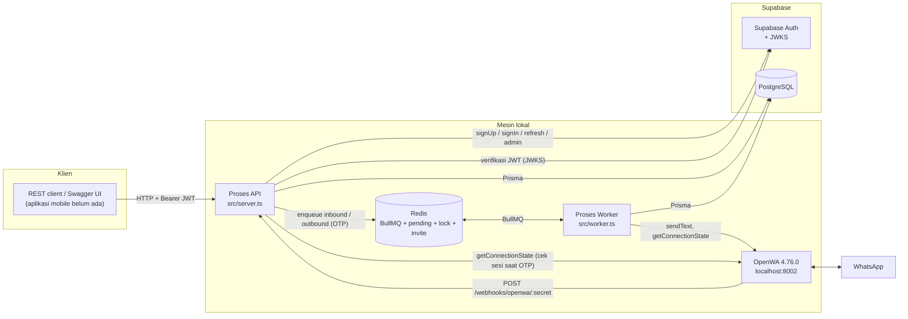
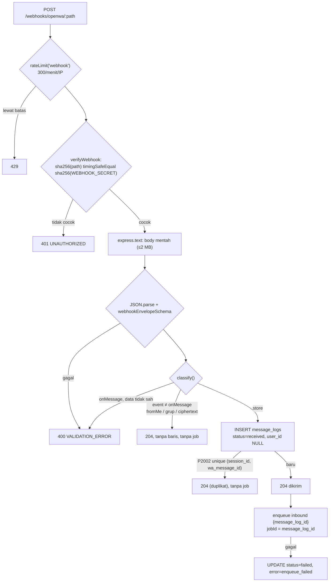
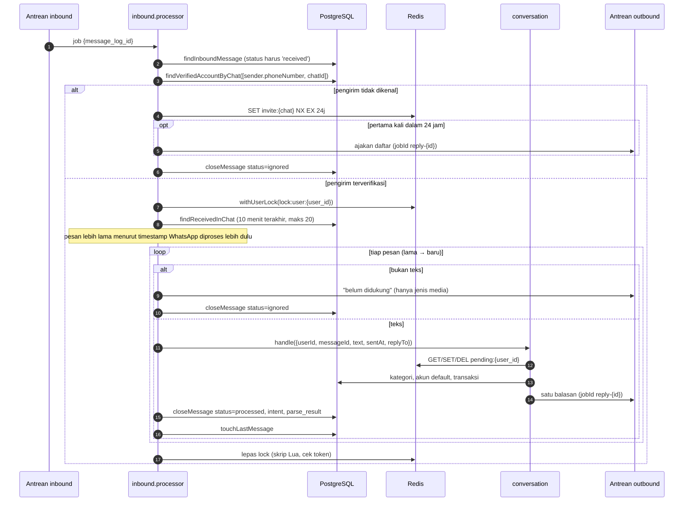
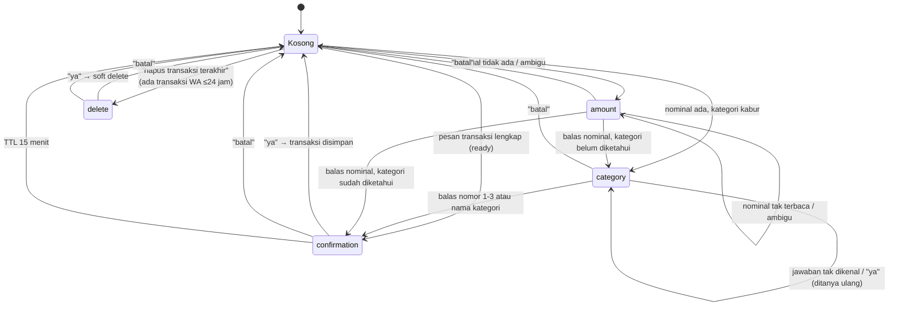
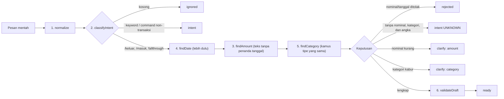
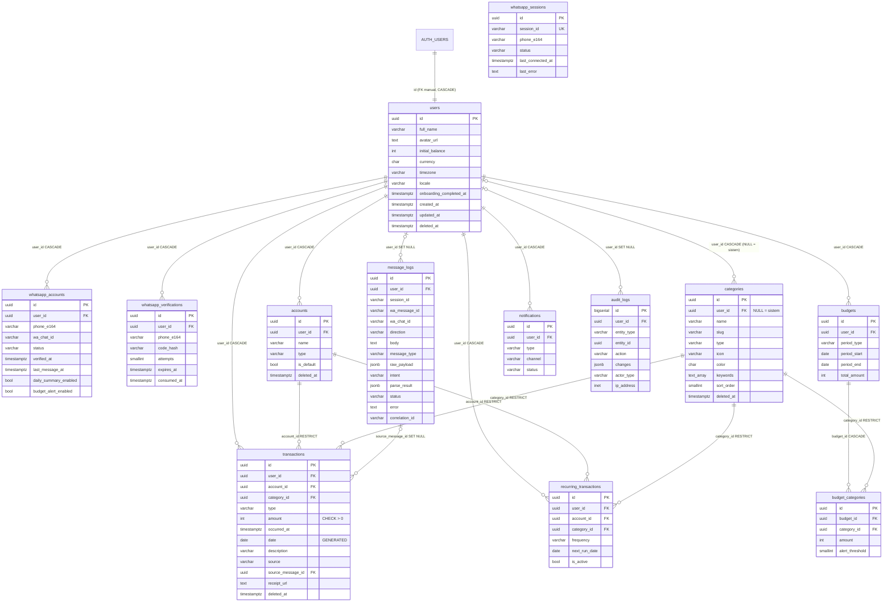
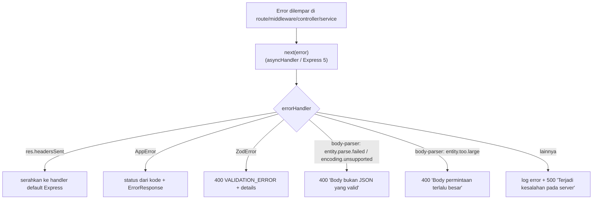

# System Documentation — Cashify Backend

Dokumentasi teknis backend Cashify (nama kode di dokumen rancangan: MyFinance), disusun dari audit source code.

| | |
| --- | --- |
| Tanggal audit | 6 Oktober 2026 |
| Basis audit | Branch `main`, commit terakhir `44204ea`, **ditambah perubahan yang belum di-commit** di working tree (modul `webhooks`, `whatsapp`, `parsers/`, `queues/`, `workers/`, `gateways/`, dan lainnya; lihat `git status`) |
| Sumber kebenaran | Source code di `src/`, `prisma/schema.prisma`, dan `prisma/migrations/`. Dokumen di `claude/` dipakai hanya sebagai pembanding (Bagian 12) |
| Status verifikasi | `npm run typecheck` lulus. `npm run test`: 34 berkas lulus, 11 berkas dilewati; 1.316 test lulus, 375 dilewati karena Redis dan Postgres test tidak menyala saat audit |

**Label status yang dipakai di seluruh dokumen:**

| Label | Arti |
| --- | --- |
| **Implemented** | Ada di source code dan dirakit ke aplikasi |
| **Partial** | Sebagian ada, atau ada tetapi tidak dirakit/tidak lengkap |
| **Changed** | Ada, tetapi berbeda dari rancangan |
| **Not implemented** | Dirancang, tidak ada di source code |
| **New** | Tidak ada di rancangan awal, muncul selama pengembangan |
| **Needs Verification** | Tidak dapat dipastikan dari source code saja |

Dokumen ini tidak memuat kredensial apa pun. Contoh token ditulis terpotong (`eyJhbGciOi...`), dan contoh UUID berasal dari contoh di skema OpenAPI.

---

## Daftar Isi

1. [System Overview](#1-system-overview)
2. [Technology Stack](#2-technology-stack)
3. [System Architecture](#3-system-architecture)
4. [Project Structure](#4-project-structure)
5. [Application Flow](#5-application-flow)
6. [Authentication & Authorization](#6-authentication--authorization)
7. [API Documentation](#7-api-documentation)
8. [Request & Response Specification](#8-request--response-specification)
9. [Database & Data Model](#9-database--data-model)
10. [External Integrations](#10-external-integrations)
11. [Error Handling](#11-error-handling)
12. [Planned Architecture vs Current Implementation](#12-planned-architecture-vs-current-implementation)
13. [Known Gaps, Limitations & Technical Debt](#13-known-gaps-limitations--technical-debt)
14. [Security Considerations](#14-security-considerations)
15. [Development Notes](#15-development-notes)
16. [Future Improvements](#16-future-improvements)
17. [Conclusion](#17-conclusion)

---

## 1. System Overview

### Tujuan sistem

Cashify adalah API keuangan pribadi dengan **dua kanal masuk ke satu sistem yang sama**:

1. **REST API** untuk aplikasi mobile. Aplikasi mobile belum dibangun; saat ini konsumennya adalah koleksi REST client di `rest/` dan Swagger UI di `/api-docs`.
2. **WhatsApp** lewat webhook dari OpenWA 4.76.0. Pengguna mengirim pesan seperti `tadi makan siang 25 ribu` ke nomor bot, sistem memahaminya, meminta konfirmasi lewat chat, lalu menyimpan transaksi setelah pengguna membalas `ya`.

### Masalah yang diselesaikan

Mencatat keuangan lewat aplikasi menuntut pengguna membuka aplikasi, memilih kategori, dan mengetik nominal. Cashify memungkinkan pencatatan lewat satu pesan chat, dengan tiga jaminan yang ditegakkan di kode:

- **Nominal dan tanggal tidak pernah ditebak model bahasa.** Keduanya diekstraksi regex di `src/parsers/`. Bila nominal tidak jelas, bot bertanya.
- **Tidak ada transaksi ganda** walau OpenWA mengirim webhook lebih dari sekali (unique index di `message_logs`).
- **Tidak ada transaksi tanpa konfirmasi** lewat WhatsApp; setiap pencatatan menunggu balasan `ya`.

### Teknologi utama

Node.js 22, TypeScript (ESM), Express 5, Prisma 6, PostgreSQL di Supabase, Supabase Auth, Redis 7, BullMQ, Zod 4, pino, OpenWA 4.76.0.

### Arsitektur singkat

Monolit modular dengan **dua proses** dari satu basis kode:

- **API** (`src/server.ts`): REST API dan penerima webhook. Fase sinkron webhook hanya menyimpan pesan mentah lalu memasukkan ID-nya ke antrean.
- **Worker** (`src/worker.ts`): memproses pesan WhatsApp (parser, percakapan, penyimpanan transaksi) dan satu-satunya proses yang mengirim pesan ke WhatsApp.

Keduanya berbagi PostgreSQL (Supabase) dan Redis (antrean BullMQ, state percakapan, lock per pengguna).

### Komponen utama

| Komponen | Lokasi | Peran |
| --- | --- | --- |
| Modul REST | `src/modules/*` | auth, users, accounts, categories, transactions, dashboard, whatsapp, webhooks |
| Parser | `src/parsers/` | Pipeline enam tahap, fungsi murni |
| Percakapan WhatsApp | `src/modules/whatsapp/whatsapp.conversation.ts` | Mesin state konfirmasi/klarifikasi |
| Antrean | `src/queues/` | `inbound` dan `outbound` (BullMQ) |
| Worker | `src/workers/` | Konsumen antrean dan perakit pipeline |
| Gateway | `src/gateways/` | `WhatsAppGateway` (OpenWA, mock) dan `LlmGateway` (disabled, mock) |
| Shared | `src/shared/`, `src/lib/` | Error, skema bersama, utilitas zona waktu/uang/telepon, Auth, Prisma, lock, pending state |

### Cara kerja umum

```text
Mobile/REST client ──JWT──► Express ──► service ──► repository ──► PostgreSQL
WhatsApp ──► OpenWA ──webhook──► Express (simpan mentah, 204) ──► antrean inbound
                                                                     │
                       Worker: parser → percakapan → transaksi ◄─────┘
                                     │
                         antrean outbound (1 per 2–5 detik) ──► OpenWA ──► WhatsApp
```

---

## 2. Technology Stack

### Runtime dan bahasa

| Item | Versi | Catatan |
| --- | --- | --- |
| Node.js | ≥ 22 (`engines`) | Memakai `--env-file` bawaan Node untuk memuat `.env` |
| TypeScript | 6.0.3 | `strict`, `noUncheckedIndexedAccess`, modul `NodeNext`, target ES2023 |
| Format modul | ESM (`"type": "module"`) | Impor relatif memakai sufiks `.js` |

### Dependensi produksi (`package.json`)

| Paket | Versi | Fungsi di sistem |
| --- | --- | --- |
| `express` | 5.2.1 | HTTP server dan routing. Express 5 meneruskan promise yang ditolak ke error handler |
| `@prisma/client`, `prisma` | 6.19.3 | ORM dan migrasi PostgreSQL |
| `@supabase/supabase-js` | 2.117.2 | Klien Supabase Auth. **Hanya diimpor di `src/lib/auth.ts`** |
| `jose` | 6.2.12 | Verifikasi JWT Supabase (HS256 dengan secret, atau ES256/RS256/EdDSA lewat JWKS) |
| `zod` | 4.6.5 | Validasi body/query/params, env, payload webhook, data Redis, job antrean, keluaran LLM |
| `@asteasolutions/zod-to-openapi` | 9.1.0 | Membangun dokumen OpenAPI 3.1 dari skema Zod |
| `swagger-ui-express` | 5.0.1 | Swagger UI di `/api-docs` |
| `bullmq` | 6.3.11 | Antrean `inbound` dan `outbound` |
| `ioredis` | 6.0.0 | Klien Redis (koneksi BullMQ dan klien helper) |
| `bcryptjs` | 3.0.3 | Hash kode OTP WhatsApp |
| `pino` | 10.3.1 | Logging terstruktur JSON |

### Dependensi pengembangan

| Paket | Fungsi |
| --- | --- |
| `vitest` 5.0.2, `@vitest/coverage-v8` | Test unit dan integrasi |
| `tsx` | Menjalankan TypeScript langsung (`npm run dev`, seed, ekspor OpenAPI) |
| `eslint` 10, `typescript-eslint` | Lint |
| `pino-pretty` | Log berwarna saat `NODE_ENV=development` |
| `@types/*` | Definisi tipe |

### Layanan eksternal dan infrastruktur

| Layanan | Cara berjalan | Dipakai untuk |
| --- | --- | --- |
| Supabase PostgreSQL | Remote, free tier | Database utama. Pooler port 6543 untuk runtime, koneksi langsung 5432 untuk migrasi |
| Supabase Auth | Remote, free tier | Registrasi, login (password dan Google ID token), refresh, logout, reset password |
| Redis 7 | `docker compose up -d redis` (lokal) | BullMQ, state percakapan, lock pengguna, batas ajakan daftar |
| OpenWA 4.76.0 | Proses lokal di folder `spike/` dengan tambalan user agent | Sesi bot WhatsApp tunggal; mengirim webhook dan menerima perintah kirim |
| PostgreSQL 16 (test) | `docker compose up -d postgres-test`, port 54329, tmpfs | Hanya test integrasi, dengan stub skema `auth` |
| LLM | **Tidak ada.** `LLM_PROVIDER` hanya menerima `disabled` | — |

---

## 3. System Architecture

### 3.1 Diagram komponen (implementasi aktual)



Catatan penting dari diagram:

- **Tidak ada LLM** di jalur mana pun. `LlmGateway` ada di kode tetapi tidak dirakit (Bagian 13, C1).
- **Supabase Realtime** sudah disiapkan di database (publication untuk `transactions`), tetapi tidak ada klien yang berlangganan.
- **Proses API memanggil OpenWA hanya untuk memeriksa status sesi** (sebelum menerbitkan OTP). Semua pengiriman pesan dilakukan worker.

### 3.2 Lapisan dan arah impor

Setiap modul REST mengikuti pola berlapis. Arah impor satu arah:

```text
routes ──► controller ──► service ──► repository ──► Prisma
                             │
                             ├──► gateways   (WhatsAppGateway, lewat port)
                             └──► parsers    (fungsi murni)
```

| Lapisan | Tanggung jawab | Tidak boleh |
| --- | --- | --- |
| `*.routes.ts` | Merakit middleware (auth, rate limit, validasi) dan handler | Logika bisnis |
| `*.controller.ts` | Mengambil identitas dari `req.user`, memanggil service, memilih status HTTP | Mengimpor repository |
| `*.service.ts` | Aturan bisnis, memetakan record ke bentuk respons, melempar `AppError` | Mengenal Express |
| `*.repository.ts` | Kueri Prisma, **selalu dengan filter `user_id`** | Mengimpor service |
| `*.schema.ts` | Skema Zod request/response (juga sumber OpenAPI) | — |
| `*.openapi.ts` | Mendaftarkan endpoint ke registry OpenAPI | — |
| `*.types.ts` | Tipe internal dan interface repository | — |

Pengecualian yang disengaja:

- **`webhooks/` tidak punya service.** Controller memanggil repository yang disuntikkan lewat `deps`, agar fase sinkron tetap di bawah 100 ms (aturan proyek nomor 4).
- **`dashboard/` tidak punya repository.** Ia agregator yang memanggil service `users`, service `transactions`, dan `transactions.summary.ts`.
- Modul tidak saling mengimpor, kecuali `dashboard/`. Penghubung antarmodul untuk alur WhatsApp ada di **composition root worker** (`src/workers/pipeline.ts`), yang menyambungkan modul `whatsapp` ke `transactions`, `categories`, dan `accounts` lewat interface `ConversationPorts`.

### 3.3 Composition root dan dependency injection

Tidak ada container DI. Setiap modul diekspor sebagai fungsi pabrik (`createXService(repository)`, `createXRouter(service, verifyAuth)`), lalu dirakit di dua tempat:

| Composition root | Merakit |
| --- | --- |
| `src/app.ts` (`createApp(deps)`) | Semua router REST, webhook, Swagger, middleware global. `AppDeps` memungkinkan test menyuntik Prisma, auth service, verifier JWT, gateway, dan fungsi enqueue |
| `src/workers/pipeline.ts` (`createInboundPipeline`) | Repository WhatsApp, service transaksi, repository kategori dan akun, pending store, percakapan, pemroses inbound |
| `src/worker.ts` | Koneksi Redis, gateway OpenWA, pipeline, dua worker BullMQ, penanganan sinyal |

Konfigurasi lingkungan (`src/config/env.ts`) memanggil `process.exit(1)` bila variabel tidak valid. Karena itu banyak dependensi dibuat **lazy** (dimuat lewat `import()` dinamis saat dipakai pertama kali): verifier JWT, provider Supabase Auth, gateway OpenWA di proses API, antrean bersama, dan rahasia webhook. Dengan begitu `createApp()` bisa dimuat di test tanpa `.env`.

### 3.4 Dua proses

| | Proses API | Proses Worker |
| --- | --- | --- |
| Entry point | `src/server.ts` | `src/worker.ts` |
| Perintah | `npm run dev` | `npm run dev:worker` |
| Mendengarkan | `HOST:PORT` (bawaan `127.0.0.1:3000`) | Antrean BullMQ `inbound` dan `outbound` |
| Menulis ke DB | Semua endpoint REST, baris `message_logs` mentah | Transaksi dari WhatsApp, status `message_logs`, `whatsapp_accounts.last_message_at` |
| Mengirim WhatsApp | Tidak pernah (hanya memasukkan OTP ke antrean) | Ya, lewat `WhatsAppGateway.sendText` |
| Jumlah instance | Bebas | **Harus satu** (laju kirim `outbound` bersifat global) |
| Shutdown | Default Node | SIGTERM/SIGINT: tutup worker, antrean, Redis; paksa keluar setelah 15 detik |

---

## 4. Project Structure

```text
backend/
├── claude/                      # dokumen rancangan (di .gitignore)
├── commits/                     # catatan commit per tahap (di .gitignore)
├── logs/                        # .gitkeep saja; log ditulis ke stdout
├── prisma/
│   ├── schema.prisma            # 13 model
│   ├── migrations/              # 5 migrasi (1 hasil generate + 4 SQL manual)
│   ├── seed.ts                  # entry seed: kategori sistem + pengguna demo
│   ├── seed-data.ts             # data murni 12 kategori sistem
│   ├── seed-demo.ts             # pengguna demo, dompet, ±170 transaksi
│   ├── seed-demo-data.ts        # generator data demo (murni)
│   └── seed-demo-redis.ts       # membersihkan pending/lock demo di Redis
├── rest/                        # koleksi REST Client (.http) dan Postman
├── scripts/export-openapi.ts    # menulis claude/openapi.json
├── spike/                       # spike OpenWA: tambalan UA, rekaman payload nyata
├── src/
│   ├── server.ts                # entry point API
│   ├── worker.ts                # entry point worker
│   ├── app.ts                   # composition root API
│   ├── config/                  # env, logger, redis, openapi, swagger
│   ├── lib/                     # auth (Supabase), database (Prisma), pendingState, userLock
│   ├── middleware/              # authenticate, validate, rateLimiter, verifyWebhook, errorHandler, notFound
│   ├── modules/
│   │   ├── auth/  users/  accounts/  categories/
│   │   ├── transactions/        # + transactions.summary.ts (agregasi)
│   │   ├── dashboard/           # agregator, tanpa repository
│   │   ├── whatsapp/            # + conversation, templates, otp, session
│   │   ├── webhooks/            # tanpa service
│   │   └── audit-logs/ budgets/ notifications/ reports/   # kosong (.gitkeep)
│   ├── parsers/                 # pipeline parser, fungsi murni
│   ├── gateways/
│   │   ├── whatsapp/            # interface, OpenWA, mock
│   │   └── llm/                 # interface, disabled, mock
│   ├── queues/                  # definisi antrean inbound, outbound
│   ├── workers/                 # worker BullMQ, pemroses inbound, pipeline
│   └── shared/
│       ├── constants/           # errorCodes, limits
│       ├── errors/AppError.ts
│       ├── mappers/userProfile.ts
│       ├── openapi/             # registry, z yang ditambal .openapi()
│       ├── schemas/             # skema Zod lintas modul
│       ├── types/               # express.d.ts, user.ts
│       └── utils/               # cursor, money, phone, timezone, token, userScope, response, dst.
├── tests/
│   ├── unit/                    # termasuk tests/unit/parsers/
│   ├── integration/             # butuh Postgres test dan/atau Redis
│   ├── fixtures/openwa/         # 7 rekaman payload OpenWA nyata
│   ├── helpers/
│   └── db/init-auth-stub.sql    # stub skema auth untuk Postgres test
├── docker-compose.yml           # redis, postgres-test
├── vitest.config.ts             # fileParallelism: false
└── tsconfig.json
```

### 4.1 `src/config/`

| Berkas | Tanggung jawab |
| --- | --- |
| `env.ts` | Skema Zod untuk semua variabel lingkungan. Gagal validasi: cetak daftar masalah lalu `process.exit(1)` |
| `logger.ts` | Instance pino. `pino-pretty` hanya saat `NODE_ENV=development` |
| `redis.ts` | Dua pabrik koneksi: `createBullConnection` (`maxRetriesPerRequest: null`, syarat BullMQ) dan `createRedisClient` (gagal cepat, 3 percobaan) |
| `openapi.ts` | Mengimpor semua `*.openapi.ts`, mendaftarkan `bearerAuth` dan `/health`, membangun dokumen OpenAPI 3.1. Sengaja tidak mengimpor `env.ts` |
| `swagger.ts` | Memasang `GET /api-docs.json` dan Swagger UI di `/api-docs` |

### 4.2 `src/lib/`

| Berkas | Tanggung jawab |
| --- | --- |
| `auth.ts` | **Satu-satunya** berkas yang mengimpor `@supabase/supabase-js`. Mendefinisikan interface `AuthProvider`, implementasi Supabase, dan `mapAuthError` (kode error Supabase → `AppError`) |
| `database.ts` | `getPrisma()`: satu `PrismaClient`, dibuat saat dipakai pertama kali |
| `pendingState.ts` | Store `pending:{user_id}` di Redis (TTL 15 menit), divalidasi skema Zod dari pemanggil |
| `userLock.ts` | Lock `lock:user:{user_id}` (SET NX PX 30 detik, pelepasan lewat skrip Lua yang memeriksa token pemilik), retry 500 ms × 5 |

### 4.3 `src/middleware/`

| Berkas | Tanggung jawab |
| --- | --- |
| `authenticate.ts` | Membaca `Authorization: Bearer`, memverifikasi JWT, mengisi `req.user = { id, email? }` |
| `validate.ts` | Validasi Zod untuk `params`, `query`, `body` sekaligus; hasil parse menggantikan nilai asli (field tak dikenal dibuang) |
| `rateLimiter.ts` | Fixed window in-memory per proses. Enam batas bernama (Bagian 7.2) |
| `verifyWebhook.ts` | Membandingkan segmen path dengan `WEBHOOK_SECRET` memakai SHA-256 + `timingSafeEqual` |
| `errorHandler.ts` | Mengubah `AppError`, `ZodError`, dan error body-parser menjadi `ErrorResponse`; selain itu 500 generik |
| `notFound.ts` | 404 untuk rute yang tidak terdaftar |

### 4.4 `src/modules/`

| Modul | Berkas | Isi |
| --- | --- | --- |
| `auth` | 7 | Register, login, Google, refresh, logout, lupa/reset password. Provisioning pengguna baru dalam satu transaksi DB |
| `users` | 7 | `GET/PATCH /me` |
| `accounts` | 7 | `GET /accounts` (hanya baca) |
| `categories` | 7 | `GET /categories`, `mergeCategories` (salinan pengguna menang atas kategori sistem), `listWithKeywords` untuk kamus parser |
| `transactions` | 8 | CRUD + restore, audit log, optimistic locking, cursor; `transactions.summary.ts` untuk agregasi dashboard; metode khusus WhatsApp (`createFromWhatsapp`, `findBySourceMessage`, `latestFromWhatsapp`, `topCategoryIds`) |
| `dashboard` | 6 | Agregator; tanpa repository |
| `whatsapp` | 11 | Penautan OTP (`service`, `otp`, `session`), percakapan bot (`conversation`), template balasan (`templates`), repository untuk akun, verifikasi, sesi, dan pesan masuk |
| `webhooks` | 6 | Penerima webhook OpenWA; tanpa service |
| `audit-logs`, `budgets`, `notifications`, `reports` | 0 | Folder kosong. Tabelnya ada, modulnya tidak |

### 4.5 `src/parsers/`

Fungsi murni tanpa Prisma, jaringan, atau jam sistem. Hanya mengimpor `shared/utils/timezone.ts` dan `shared/constants/limits.ts`. Kemurniannya dijaga `tests/unit/parsers/purity.test.ts`.

| Berkas | Tahap | Ekspor utama |
| --- | --- | --- |
| `normalize.ts` | 1 | `normalize(raw)` → `{ original, text }` (lowercase, spasi rapi, emoji dibuang) |
| `intent.ts` | 2 | `classifyIntent` — command `/…`, kata kunci (ya, batal, hapus, help, query, koreksi), jawaban klarifikasi |
| `amount.ts` | 3 | `extractAmount` / `findAmount` — nominal dengan sufiks, pemisah, `rp`, heuristik angka telanjang |
| `date.ts` | 4 | `extractDate` / `findDate` — tanggal relatif dan absolut, zona Asia/Jakarta |
| `category.ts`, `keywords.ts` | 5 | `classifyType` (penanda pemasukan), `classifyCategory` (kamus dari DB, kata utuh) |
| `validate.ts` | 6 | `validateDraft`, `limitDescription` |
| `index.ts` | Orkestrator | `parseMessage(raw, context)` |
| `types.ts` | — | Kontrak semua tahap dan `ParseResult` |

### 4.6 `src/gateways/`, `src/queues/`, `src/workers/`

| Berkas | Tanggung jawab |
| --- | --- |
| `gateways/whatsapp/whatsapp.gateway.ts` | Interface `WhatsAppGateway { sendText(to, body): Promise<void>; getStatus(): Promise<{connected, detail?}> }` |
| `gateways/whatsapp/openwa.gateway.ts` | Implementasi HTTP ke OpenWA Easy API v4 |
| `gateways/whatsapp/mock.gateway.ts` | Gateway palsu untuk test |
| `gateways/llm/*` | Kontrak `LlmClassificationSchema` (strict, tanpa `amount`/`date`), `safeClassify`, `DisabledLlmGateway`, mock. **Tidak dipakai** di luar folder ini |
| `queues/inbound.queue.ts` | Antrean `inbound`, job `{ message_log_id }`, `jobId` = id pesan, concurrency 5 |
| `queues/outbound.queue.ts` | Antrean `outbound`, job `{ wa_chat_id, text, message_log_id? }`, concurrency 1, jeda acak 2–5 detik |
| `queues/index.ts` | `getQueues()`: antrean bersama untuk produsen di proses API |
| `workers/inbound.worker.ts` | Pembungkus BullMQ: validasi job, `onExhausted` saat percobaan terakhir gagal |
| `workers/inbound.processor.ts` | Logika satu pesan masuk: identifikasi pengirim, lock, urutan pesan, media vs teks |
| `workers/outbound.worker.ts` | Kirim, jeda acak, tunda saat sesi terputus, gugurkan job berumur > 1 jam |
| `workers/pipeline.ts` | Composition root pemroses inbound |
| `workers/index.ts` | `startWorkers()` dengan `ready()` dan `close()` |

### 4.7 `src/shared/`

| Berkas | Tanggung jawab |
| --- | --- |
| `constants/errorCodes.ts` | Delapan kode error dan status HTTP-nya |
| `constants/limits.ts` | `MAX_TRANSACTION_AMOUNT = 1_000_000_000`, `MAX_INT32`, `MAX_DESCRIPTION_LENGTH = 255`, ukuran halaman 20/100 |
| `errors/AppError.ts` | Kelas error yang boleh sampai ke klien |
| `schemas/common.schema.ts` | Primitif (UUID, tanggal, rupiah), `ErrorResponse`, ringkasan kategori/akun, paginasi |
| `schemas/user.schema.ts` | `UserProfile`, `Session`, `AuthResult` |
| `utils/userScope.ts` | `requireUserId`, `ownedBy`, `visibleTo`: penjaga filter `user_id` di repository |
| `utils/timezone.ts` | **Semua** perhitungan Asia/Jakarta (UTC+7 tetap) |
| `utils/money.ts` | `formatRupiah`, `parseRupiah`, `isRupiah` (bilangan bulat) |
| `utils/phone.ts` | Normalisasi E.164 Indonesia, konversi ke `@c.us`, penyamaran nomor |
| `utils/cursor.ts` | Cursor base64url berisi JSON, divalidasi skema |
| `utils/token.ts` | `createTokenVerifier` (jose) |
| `utils/response.ts` | `sendOk`, `sendCreated`, `sendNoContent`, `buildErrorBody` |
| `utils/requestUser.ts` | `requireUser(req)`: satu-satunya jalan controller memperoleh identitas |
| `utils/zodErrors.ts` | Memasang locale Zod bahasa Indonesia; isu Zod → `details` |

---

## 5. Application Flow

### 5.1 Alur request REST terautentikasi

Contoh `POST /transactions`:

```mermaid
sequenceDiagram
    autonumber
    participant C as Klien
    participant G as rateLimit('global')
    participant J as express.json
    participant A as authenticate
    participant RL as rateLimit('createTransaction')
    participant V as validate(body)
    participant Ctl as controller
    participant S as service
    participant R as repository
    participant DB as PostgreSQL

    C->>G: POST /transactions + Bearer JWT
    G->>J: lolos (≤100/menit/IP)
    J->>A: body JSON (≤100 KB)
    A->>A: verifikasi JWT (jose), req.user = {id: sub, email}
    A->>RL: lolos
    RL->>V: lolos (≤60/menit/pengguna)
    V->>Ctl: req.body hasil parse Zod
    Ctl->>S: create(userId dari req.user, body, {ipAddress})
    S->>R: findVisibleCategory, findOwnedAccount
    R->>DB: SELECT ... WHERE user_id = $1
    S->>R: create(...)
    R->>DB: BEGIN; INSERT transactions; INSERT audit_logs; COMMIT
    R-->>S: record
    S-->>Ctl: Transaction (snake_case)
    Ctl-->>C: 201 Transaction
```

Error di langkah mana pun diteruskan ke `next(error)` dan diubah oleh `errorHandler` menjadi `ErrorResponse` (Bagian 11).

### 5.2 Urutan middleware di `src/app.ts`

| Urutan | Mount | Middleware/handler | Berlaku untuk |
| --- | --- | --- | --- |
| 1 | `/webhooks` | Router webhook (rate limit webhook → verifikasi rahasia → `express.text` 2 MB → controller) | Webhook saja. Dipasang **sebelum** pembatas global dan `express.json` |
| 2 | `/` | `rateLimit('global')` 100/menit/IP | Semua rute selain `/webhooks` |
| 3 | `/` | `express.json({ limit: '100kb' })` | Semua rute selain `/webhooks` |
| 4 | `/health` | Handler statis | — |
| 5 | `/api-docs`, `/api-docs.json` | Swagger | — |
| 6 | `/auth` | Router auth (limiter per rute) | — |
| 7 | `/me`, `/accounts`, `/categories`, `/transactions`, `/whatsapp`, `/dashboard` | Router dengan `router.use(verifyAuth)` di awal | Semua rute di bawahnya butuh JWT |
| 8 | `/` | `notFound` | Rute tak terdaftar |
| 9 | `/` | `errorHandler` | Semua error |

Konsekuensi urutan: di router terproteksi, `authenticate` berjalan sebelum `validate`, jadi request tanpa token ke `/transactions/bukan-uuid` dijawab **401**, bukan 400.

### 5.3 Webhook OpenWA: fase sinkron



Yang disimpan di `message_logs`: `session_id` (dari amplop), `wa_message_id` (`data.id`), `wa_chat_id` (`data.chatId`, berupa LID `...@lid` untuk chat pribadi), `message_type`, `body` (teks untuk `chat`, `caption` untuk media), `raw_payload` (amplop utuh), `correlation_id` (`id` amplop).

### 5.4 Worker: fase asinkron pesan masuk



Penanganan kegagalan:

- Job inbound: 3 percobaan, backoff eksponensial 1 detik. Pada percobaan terakhir, `markInboundFailed` menandai pesan `failed` dengan pesan error (maks. 500 karakter).
- `UserLockTimeoutError` (lock tidak didapat setelah 6 percobaan, ±2,5 detik) membuat job gagal dan diulang BullMQ.
- Idempotensi: `closeMessage` hanya menutup baris yang masih `received`; transaksi dijaga `findBySourceMessage`; balasan dijaga `jobId: reply-<message_log_id>`.

### 5.5 Mesin state percakapan WhatsApp

State tunggal per pengguna disimpan di Redis `pending:{user_id}` (TTL 15 menit). Pending baru menimpa yang lama tanpa pemberitahuan; tidak ada pesan pengingat saat kedaluwarsa.



Perilaku per intent (dari `whatsapp.conversation.ts`):

| Intent | Contoh | Aksi |
| --- | --- | --- |
| `CREATE_TRANSACTION` | `makan siang 25 ribu`, `/keluar 25000 makanan`, `/masuk 5000000 gaji` | Parse → `confirmation`, `category`, atau `amount`; ditolak bila nominal/tanggal tidak sah |
| `CONFIRM` | `ya`, `y`, `ok`, `iya`, `betul` | Simpan transaksi (`source='whatsapp'`, akun default) atau eksekusi hapus |
| `CANCEL` | `batal`, `no`, `n`, `gajadi`, `salah` | Hapus pending |
| `CLARIFY_RESPONSE` | `2`, `makanan`, `25 ribu` saat ditanya | Lengkapi pending |
| `DELETE` | `hapus transaksi terakhir`, `/hapus` | Tawarkan transaksi `whatsapp` terbaru dalam 24 jam |
| `HELP` | `bantuan`, `/help` | Panduan |
| `QUERY` | `saldo`, `/saldo`, `berapa pengeluaran` | **Belum tersedia**: balasan "buka aplikasi" |
| `CORRECT` | `ubah jadi 35 ribu` | **Belum tersedia**: balasan "ubah di aplikasi" |
| `UNKNOWN` | lainnya | Panduan singkat, atau mengingatkan pertanyaan yang sedang menunggu |
| `IGNORED` | pesan kosong/hanya emoji | Tidak dibalas |

Semua teks balasan berasal dari `whatsapp.templates.ts` (maks. 5 baris, maks. 1 emoji di awal), dijaga `tests/unit/whatsapp-templates.test.ts`.

### 5.6 Pipeline parser



Aturan ekstraksi nominal (`amount.ts`), semuanya aritmetika bilangan bulat:

| Input | Hasil |
| --- | --- |
| `25000`, `25.000`, `25,000`, `Rp25.000`, `rp 25000` | 25.000 |
| `25rb`, `25 ribu`, `25k` | 25.000 |
| `1.5 juta`, `1,5jt`, `1.5m` | 1.500.000 |
| `20` (pengeluaran) | 20.000, ditandai `amount_in_thousands` dan tampil di konfirmasi |
| `5` (pemasukan, `gaji 5`) | `ambiguous` → bot bertanya "5 ribu atau 5 juta?" |
| Dua nominal berbeda dengan prioritas sama | `missing` → bot bertanya |
| `-25000`, `0`, > 1.000.000.000 | Ditolak (`negative`, `zero`, `too_large`) |
| `25.5` tanpa sufiks | Tidak terbaca |

Aturan tanggal (`date.ts`), acuan Asia/Jakarta dari `now` (waktu pesan menurut WhatsApp):

| Input | Hasil |
| --- | --- |
| Tidak disebut, `tadi`, `barusan`, `hari ini` | Hari ini |
| `kemarin`, `kemaren` | −1 hari |
| `kemarin lusa` | −2 hari |
| `N hari lalu` | −N hari |
| `senin kemarin` | Senin terakhir yang sudah lewat |
| `tadi malam` | Hari ini; −1 hari bila pesan dikirim pukul 00.00–03.59 WIB |
| `tanggal 25`, `25 sep`, `25 sep 2025` | Tanggal absolut (bulan/tahun berjalan bila tidak disebut) |
| `minggu lalu`, `bulan lalu`, `beberapa hari lalu` | Ditolak `too_vague` |
| `tahun lalu`, > 1 tahun ke belakang | Ditolak `too_old` |
| `besok`, `lusa`, `minggu depan`, `N hari lagi`, tanggal di masa depan | Ditolak `future` |
| `30 feb` | Ditolak `invalid_date` |

Tipe transaksi: pemasukan bila ada kata utuh `gaji`, `bonus`, `thr`, `dapat`, `terima`, `masuk`, `untung`, `dibayar`, `fee`, `komisi`; selain itu pengeluaran. Kategori: kata kunci dan nama kategori dari database (kata utuh), kata kunci generik `beli` kalah dari kata kunci spesifik.

### 5.7 Penautan WhatsApp lewat OTP

```mermaid
sequenceDiagram
    autonumber
    participant C as Klien (JWT)
    participant API as API /whatsapp
    participant DB as PostgreSQL
    participant GW as OpenWA (getStatus)
    participant OQ as Antrean outbound
    participant W as Worker outbound
    participant U as WhatsApp pengguna

    C->>API: POST /whatsapp/link/request {phone}
    API->>DB: tautan aktif milik pengguna? (verified → 409)
    API->>DB: nomor sudah verified akun lain? (→ 409)
    API->>DB: hitung OTP 24 jam per nomor (≥3) & per pengguna (≥5) → 429
    API->>GW: getConnectionState (cache 10 detik) → 503 bila terputus
    API->>DB: upsert whatsapp_accounts status=pending; kode lama ditandai consumed
    API->>DB: INSERT whatsapp_verifications (bcrypt hash, kedaluwarsa 10 menit)
    API->>OQ: {wa_chat_id: 62…@c.us, text: OTP}
    API-->>C: 200 {status: pending, expires_at, masked_phone}
    OQ->>W: job
    W->>U: sendText (jeda 2–5 detik)
    C->>API: POST /whatsapp/link/verify {code}
    API->>DB: UPDATE attempts+1 WHERE attempts < 5 (atomik)
    API->>API: bcrypt.compare
    API->>DB: BEGIN; consumed_at; status=verified; COMMIT
    API-->>C: 200 {status: verified, phone (tersamar), verified_at}
```

Setelah `verified`, pesan dari nomor itu dikenali worker lewat `whatsapp_accounts.wa_chat_id` (`628…@c.us`) yang dicocokkan dengan `raw_payload.data.sender.phoneNumber`.

### 5.8 Pengiriman pesan keluar

Worker `outbound` (`concurrency: 1`, konstanta, tidak dapat diubah dari opsi):

1. Validasi job; data tidak sah → `UnrecoverableError` (tidak diulang).
2. Job lebih tua dari 1 jam → `UnrecoverableError` (balasan basi tidak dikirim).
3. `gateway.getStatus()`; terputus → `moveToDelayed(+30 detik)` + `DelayedError` (tidak memakai jatah percobaan).
4. `gateway.sendText(wa_chat_id, text)`.
5. **Selalu** jeda acak 2.000–5.000 ms setelah langkah 4, berhasil maupun gagal. Jeda dibatalkan saat worker ditutup.
6. Gagal kirim: 3 percobaan, backoff eksponensial 5 detik; percobaan terakhir mencatat `message_logs.error = 'reply_failed'` bila job punya `message_log_id` (OTP tidak punya, hanya dicatat di log).

---

## 6. Authentication & Authorization

### 6.1 Model identitas

- **Supabase Auth memegang kredensial.** Express tidak menyimpan password dan tidak menerbitkan token.
- Tabel `public.users` memperluas `auth.users`: `users.id` = `auth.users.id`, dengan FK `ON DELETE CASCADE` (migrasi `link_users_to_auth`).
- Email tidak disimpan di `public.users`; diambil dari klaim JWT `email`.

### 6.2 Cara pengguna masuk

| Jalur | Endpoint | Mekanisme |
| --- | --- | --- |
| Email + password | `POST /auth/register`, `POST /auth/login` | `supabase.auth.signUp` / `signInWithPassword` dengan anon key |
| Google | `POST /auth/google` | Klien melakukan Google Sign-In native, mengirim `id_token`; backend memanggil `signInWithIdToken({ provider: 'google' })` |
| Refresh | `POST /auth/refresh` | `refreshSession`; refresh token dirotasi oleh Supabase |

Semua jalur mengembalikan objek `Session` dari Supabase (`access_token`, `refresh_token`, `token_type`, `expires_in`, `expires_at`). Klien mengirim `access_token` sebagai `Authorization: Bearer <token>`.

**Provisioning pengguna.** Baris `users`, akun default "Tunai" (`type: cash`, `is_default: true`), dan salinan seluruh kategori sistem dibuat dalam **satu transaksi Prisma** (`auth.repository.ts → provisionNewUser`):

- `register`: provisioning segera setelah `signUp`. Bila transaksi DB gagal, akun Supabase yang sudah dibuat dihapus lagi (best effort, `deleteUser`). Bila Supabase tidak menerbitkan sesi (konfirmasi email menyala), dianggap gagal → 500.
- `login` dan `google`: bila baris `users` belum ada (login Google pertama, atau register yang gagal di tengah), provisioning dilakukan saat itu dengan `initial_balance = 0`. Bila `users.deleted_at` terisi → 401 "Akun ini sudah dihapus". Balapan dua login pertama ditangani dengan membaca hasil pemenang (`UserAlreadyProvisionedError`).
- Bila tabel kategori sistem kosong, provisioning gagal (`SystemCategoriesMissingError` → 500). Jalankan `npm run seed`.

### 6.3 Validasi token

`src/shared/utils/token.ts` (`createTokenVerifier`), dipakai middleware `authenticate`:

| Pemeriksaan | Nilai |
| --- | --- |
| Header | `^Bearer\s+(\S+)$` (case-insensitive), token ≤ 8.192 karakter |
| Algoritma | `HS256` → diverifikasi dengan `SUPABASE_JWT_SECRET`; `ES256`, `RS256`, `EdDSA` → JWKS dari `{SUPABASE_URL}/auth/v1/.well-known/jwks.json` (di-cache jose) |
| `iss` | `{SUPABASE_URL}/auth/v1` |
| `aud` | `authenticated` |
| `exp` | Diperiksa jose |
| `sub` | Wajib string tidak kosong |

Setiap kegagalan menghasilkan 401 `"Token tidak valid atau kedaluwarsa"`; alasan sebenarnya tidak dibocorkan. Header tidak ada atau salah bentuk: 401 `"Token autentikasi tidak ada"`.

### 6.4 Penerusan identitas ke request

```text
JWT.sub ──► req.user.id        (selalu)
JWT.email ─► req.user.email    (bila ada)
```

Controller memperoleh identitas hanya lewat `requireUser(req)` (`shared/utils/requestUser.ts`). `user_id` **tidak pernah** dibaca dari body, query, params, atau header lain. Field `user_id` yang dikirim di body dibuang oleh Zod (field tak dikenal di-strip).

`GET /me`, `PATCH /me`, dan `GET /dashboard` juga membutuhkan klaim `email`; token tanpanya dijawab 401 `"Token tidak memuat email"`.

### 6.5 Authorization

**Tidak ada role atau permission.** Semua pengguna terautentikasi setara. Kode `FORBIDDEN` (403) didefinisikan tetapi tidak dipakai endpoint mana pun.

Otorisasi berbasis **kepemilikan data**, ditegakkan di repository:

| Penjaga | Lokasi | Perilaku |
| --- | --- | --- |
| `requireUserId(userId)` | `shared/utils/userScope.ts` | Melempar `TypeError` bila `userId` bukan UUID. Mencegah `where: { userId: undefined }` yang oleh Prisma dibuang diam-diam (kueri tanpa filter) |
| `ownedBy(userId)` | sama | `{ userId, deletedAt: null }` |
| `visibleTo(userId)` | sama | `{ OR: [{ userId: null }, { userId }], deletedAt: null }`, untuk kategori sistem + milik pengguna |
| Data milik pengguna lain | semua service | Dijawab **404**, sama dengan data yang tidak ada (sengaja tidak dibedakan) |

**RLS PostgreSQL bukan pertahanan untuk API.** Prisma terhubung sebagai pemilik tabel dan melewati RLS. RLS hanya melindungi jalur klien Supabase langsung (Realtime dengan anon key + JWT pengguna). Lihat Bagian 9.5.

### 6.6 Endpoint publik vs terproteksi

| Jenis | Endpoint |
| --- | --- |
| Publik | `GET /health`, `GET /api-docs`, `GET /api-docs.json`, `POST /auth/register`, `POST /auth/login`, `POST /auth/google`, `POST /auth/refresh`, `POST /auth/forgot-password`, `POST /auth/reset-password` |
| Rahasia di path (bukan JWT) | `POST /webhooks/openwa/{path}` |
| JWT | Semua lainnya, termasuk `POST /auth/logout` |

### 6.7 Logout dan reset password

- `POST /auth/logout` memanggil `auth.admin.signOut(accessToken, 'global')` dengan service role key. Cakupan `'global'` mencabut **semua sesi pengguna**, bukan hanya sesi saat ini (lihat Bagian 13, C2). Access token yang sudah terbit tetap valid secara kriptografis sampai `exp`, karena verifikasi JWT bersifat stateless.
- `POST /auth/reset-password` memvalidasi token lewat `auth.admin.getUser(token)` lalu mengganti password lewat `auth.admin.updateUserById`. Kode tidak memeriksa bahwa token adalah token pemulihan (lihat Bagian 13, C3).

---

## 7. API Documentation

### 7.1 Endpoint Summary

Base URL lokal: `http://localhost:3000` (bawaan `HOST=127.0.0.1`, `PORT=3000`). **Tanpa prefiks `/v1`.**

| # | Method | Endpoint | Fungsi | Auth | Role | Rate limit khusus |
| --- | --- | --- | --- | --- | --- | --- |
| 1 | GET | `/health` | Status layanan | — | — | global |
| 2 | GET | `/api-docs` | Swagger UI | — | — | global |
| 3 | GET | `/api-docs.json` | Spesifikasi OpenAPI 3.1 | — | — | global |
| 4 | POST | `/auth/register` | Daftar akun | — | — | 3/jam/IP |
| 5 | POST | `/auth/login` | Masuk email+password | — | — | 5/15 menit/IP (bersama #6) |
| 6 | POST | `/auth/google` | Masuk/daftar Google ID token | — | — | 5/15 menit/IP (bersama #5) |
| 7 | POST | `/auth/refresh` | Tukar refresh token | — | — | global |
| 8 | POST | `/auth/logout` | Keluar | JWT | — | global |
| 9 | POST | `/auth/forgot-password` | Kirim email reset | — | — | global |
| 10 | POST | `/auth/reset-password` | Setel password baru | — | — | global |
| 11 | GET | `/me` | Profil | JWT | — | global |
| 12 | PATCH | `/me` | Ubah profil | JWT | — | global |
| 13 | GET | `/dashboard` | Ringkasan beranda | JWT | — | global |
| 14 | GET | `/transactions` | Daftar transaksi | JWT | — | global |
| 15 | POST | `/transactions` | Buat transaksi | JWT | — | 60/menit/pengguna |
| 16 | GET | `/transactions/{id}` | Detail transaksi | JWT | — | global |
| 17 | PATCH | `/transactions/{id}` | Ubah sebagian | JWT | — | global |
| 18 | DELETE | `/transactions/{id}` | Soft delete | JWT | — | global |
| 19 | POST | `/transactions/{id}/restore` | Pulihkan | JWT | — | global |
| 20 | GET | `/categories` | Daftar kategori | JWT | — | global |
| 21 | GET | `/accounts` | Daftar dompet | JWT | — | global |
| 22 | GET | `/whatsapp/status` | Status tautan | JWT | — | global |
| 23 | POST | `/whatsapp/link/request` | Kirim OTP | JWT | — | global + kuota harian di service |
| 24 | POST | `/whatsapp/link/verify` | Verifikasi OTP | JWT | — | global + 5 percobaan per kode |
| 25 | POST | `/whatsapp/link/resend` | Kirim ulang OTP | JWT | — | global + jeda 60 detik + kuota harian |
| 26 | DELETE | `/whatsapp/link` | Putuskan tautan | JWT | — | global |
| 27 | PATCH | `/whatsapp/preferences` | Sakelar notifikasi | JWT | — | global |
| 28 | POST | `/webhooks/openwa/{path}` | Penerima event OpenWA | Rahasia di path | — | 300/menit/IP (tanpa global) |

Kolom **Role** kosong karena sistem tidak punya role (Bagian 6.5). Endpoint #2 dan #3 tidak tercantum di `claude/API.md`, tetapi terpasang di `src/config/swagger.ts`.

### 7.2 Konvensi umum

**Header request**

| Header | Kapan |
| --- | --- |
| `Content-Type: application/json` | Semua request dengan body, kecuali webhook (webhook menerima tipe apa pun dan membaca body sebagai teks) |
| `Authorization: Bearer <access_token>` | Endpoint JWT |

**Header respons rate limit** (setiap respons yang melewati pembatas):

| Header | Isi |
| --- | --- |
| `RateLimit-Limit` | Batas jendela |
| `RateLimit-Remaining` | Sisa |
| `RateLimit-Reset` | Detik hingga jendela berakhir |
| `Retry-After` | Hanya pada 429 |

Karena pembatas global dan pembatas khusus berjalan berurutan, header dari pembatas terakhir yang menimpa nilai sebelumnya.

**Tabel batas** (`src/middleware/rateLimiter.ts`, fixed window, in-memory per proses):

| Nama | Jendela | Maks | Kunci |
| --- | --- | --- | --- |
| `global` | 1 menit | 100 | IP |
| `login` | 15 menit | 5 | IP (satu instance untuk login + Google) |
| `register` | 1 jam | 3 | IP |
| `createTransaction` | 1 menit | 60 | id pengguna |
| `webhook` | 1 menit | 300 | IP |
| `whatsappLinkRequest` | 1 hari | 5 | id pengguna — **didefinisikan tetapi tidak dipasang** di rute mana pun; kuota OTP dihitung di service dari tabel `whatsapp_verifications` |

**Format data**

| Hal | Aturan |
| --- | --- |
| Nama field | `snake_case` |
| Uang | Bilangan bulat rupiah (`25000`), tanpa desimal atau string |
| Tanggal | `YYYY-MM-DD` (kalender Asia/Jakarta) |
| Timestamp | ISO 8601 UTC dari `Date.toISOString()` (`2026-09-28T05:12:35.000Z`) |
| ID | UUID; ID bukan UUID di path → 400 |
| Sukses | Objek telanjang tanpa amplop |
| Kosong | `204 No Content` tanpa body |
| Error | `{ "error": { "code", "message", "details?" } }` (Bagian 11) |

**Error yang berlaku di semua endpoint** dan tidak diulang di setiap endpoint:

| Status | Code | Kondisi |
| --- | --- | --- |
| 400 | `VALIDATION_ERROR` | `"Body bukan JSON yang valid"` (JSON rusak) atau `"Body permintaan terlalu besar"` (> 100 KB; webhook > 2 MB) |
| 429 | `RATE_LIMITED` | Batas global terlampaui (semua kecuali webhook) |
| 500 | `INTERNAL_ERROR` | Error tak terduga: `"Terjadi kesalahan pada server"` |

Endpoint JWT juga selalu dapat menghasilkan 401 `"Token autentikasi tidak ada"` atau `"Token tidak valid atau kedaluwarsa"`.

**Bentuk `details` untuk error validasi Zod:** `[{ "field": "<path bertitik>", "issue": "<kode isu Zod>" }]`, misalnya `{ "field": "amount", "issue": "too_small" }`. Error pada level objek (aturan `refine`) tidak punya `field` dan bernilai `{ "issue": "custom" }`. `message` adalah pesan isu pertama, berbahasa Indonesia (locale Zod `id`, atau pesan khusus bila skema mendefinisikannya).

### 7.3 Endpoint Details

Setiap endpoint di bawah memakai format yang sama. Objek respons bersama (`UserProfile`, `Session`, `Transaction`, dst.) dijelaskan field per field di Bagian 8 dan dirujuk dengan nama.

---

#### `GET /health`

| | |
| --- | --- |
| Tujuan | Memeriksa proses API hidup |
| Auth | Tidak ada |
| Diproses oleh | Handler inline di `src/app.ts` |
| Parameter | Tidak ada |

**Respons 200**

```json
{ "status": "ok" }
```

| Field | Tipe | Keterangan |
| --- | --- | --- |
| `status` | `"ok"` | Selalu `ok` |

**Catatan:** respons statis. Tidak memeriksa koneksi database, Redis, atau OpenWA.

**Error:** hanya error umum (429 global).

---

#### `GET /api-docs` dan `GET /api-docs.json`

| | |
| --- | --- |
| Tujuan | Swagger UI interaktif (`/api-docs`, HTML) dan spesifikasi OpenAPI 3.1 mentah (`/api-docs.json`, JSON) |
| Auth | Tidak ada |
| Diproses oleh | `src/config/swagger.ts`; dokumen dibangun sekali saat `createApp()` dari registry Zod |

Spesifikasi yang sama diekspor ke `claude/openapi.json` dengan `npm run openapi`; `tests/unit/openapi.test.ts` gagal bila berkas itu basi.

---

#### `POST /auth/register`

| | |
| --- | --- |
| Tujuan | Membuat akun Supabase Auth, baris `users`, akun "Tunai", dan salinan 12 kategori sistem |
| Auth | Tidak ada |
| Rate limit | 3 per jam per IP (`register`) |
| Rantai | global → json → `rateLimit('register')` → `validate(body)` → `auth.controller.register` |
| Path/query | Tidak ada |

**Request body** (`RegisterBody`)

| Field | Tipe | Wajib | Validasi |
| --- | --- | --- | --- |
| `email` | string | Ya | Format email |
| `password` | string | Ya | 8–72 karakter. Kurang dari 8: pesan `"Password minimal 8 karakter"` |
| `full_name` | string | Ya | Di-trim, 2–100 karakter |
| `initial_balance` | integer | Tidak (bawaan `0`) | Bilangan bulat 0–2.147.483.647 |

**Contoh request**

```http
POST /auth/register
Content-Type: application/json

{
  "email": "dey@example.com",
  "password": "rahasia-banget-123",
  "full_name": "Dey",
  "initial_balance": 2350000
}
```

**Respons 201** — `AuthResult` (`{ user: UserProfile, session: Session }`)

```json
{
  "user": {
    "id": "9f3c2a1e-6b4d-4e8a-9c1f-0d5e7a8b3c21",
    "email": "dey@example.com",
    "full_name": "Dey",
    "avatar_url": null,
    "initial_balance": 2350000,
    "currency": "IDR",
    "timezone": "Asia/Jakarta",
    "locale": "id-ID",
    "onboarding_completed_at": null,
    "created_at": "2026-09-28T05:12:35.000Z"
  },
  "session": {
    "access_token": "eyJhbGciOi...",
    "refresh_token": "v1.MR5...",
    "token_type": "bearer",
    "expires_in": 3600,
    "expires_at": 1790000000
  }
}
```

**Pemrosesan:** `provider.signUp` (anon key, `user_metadata.full_name`) → bila Supabase membalas sukses dengan `identities` kosong (email sudah terdaftar, perilaku anti-enumerasi Supabase) → 409 → `repository.provisionNewUser` dalam satu transaksi. Kegagalan setelah `signUp` memicu `provider.deleteUser` (best effort).

**Error**

| Status | Code | Pesan / kondisi |
| --- | --- | --- |
| 400 | `VALIDATION_ERROR` | Body gagal validasi |
| 400 | `VALIDATION_ERROR` | `"Password terlalu lemah"`, `details: [{ field: "password", issue: "weak_password" }]` (ditolak Supabase) |
| 409 | `CONFLICT` | `"Email sudah terdaftar"`, `details: [{ field: "email", issue: "already_registered" }]` |
| 409 | `CONFLICT` | Email terdaftar lewat metode lain: `"Email ini sudah terdaftar dengan metode masuk lain. …"`, `issue: "account_exists_other_provider"` |
| 429 | `RATE_LIMITED` | Batas `register`, atau batas kirim email/permintaan Supabase (`retry_after_seconds: 60`) |
| 503 | `SERVICE_UNAVAILABLE` | `"Layanan autentikasi sedang tidak dapat dihubungi, coba lagi nanti"` atau `"Pendaftaran akun baru dinonaktifkan di server"` |
| 500 | `INTERNAL_ERROR` | Kategori sistem belum di-seed; Supabase tidak menerbitkan sesi (konfirmasi email menyala); error Supabase yang tidak dikenal |

---

#### `POST /auth/login`

| | |
| --- | --- |
| Tujuan | Login email + password lewat Supabase Auth |
| Auth | Tidak ada |
| Rate limit | 5 per 15 menit per IP, dihitung bersama `POST /auth/google` |
| Rantai | global → json → `loginLimiter` → `validate(body)` → controller |

**Request body** (`LoginBody`)

| Field | Tipe | Wajib | Validasi |
| --- | --- | --- | --- |
| `email` | string | Ya | Format email |
| `password` | string | Ya | Minimal 1 karakter |

**Contoh request**

```json
{ "email": "dey@example.com", "password": "rahasia-banget-123" }
```

**Respons 200** — `AuthResult`, bentuk sama dengan register.

**Pemrosesan:** `signInWithPassword` → `ensureProvisioned` (membuat baris `users` bila belum ada; menolak bila `deleted_at` terisi).

**Error**

| Status | Code | Pesan / kondisi |
| --- | --- | --- |
| 400 | `VALIDATION_ERROR` | Body gagal validasi |
| 401 | `UNAUTHORIZED` | `"Email atau password salah. Jika Anda mendaftar dengan Google, masuk lewat Google."` |
| 401 | `UNAUTHORIZED` | `"Email belum dikonfirmasi"`, `"Akun ini dinonaktifkan"` (diblokir di Supabase), `"Akun ini sudah dihapus"` (`users.deleted_at`) |
| 429 | `RATE_LIMITED` | Batas `login` atau batas Supabase |
| 503 | `SERVICE_UNAVAILABLE` | Supabase tidak terjangkau |

---

#### `POST /auth/google`

| | |
| --- | --- |
| Tujuan | Login atau registrasi dengan Google ID token |
| Auth | Tidak ada |
| Rate limit | Sama dan dihitung bersama `POST /auth/login` |

**Request body** (`GoogleBody`)

| Field | Tipe | Wajib | Validasi |
| --- | --- | --- | --- |
| `id_token` | string | Ya | 1–8.192 karakter |

**Contoh request**

```json
{ "id_token": "eyJhbGciOiJSUzI1NiIsImtpZCI6Ij..." }
```

**Respons 200** — `AuthResult`. Selalu 200, baik login pertama maupun berikutnya. Login pertama memprovisi pengguna dengan `full_name` dari metadata Google (`full_name` atau `name`; bila kosong/terlalu pendek, bagian lokal email; bila tetap tidak sah, `"Pengguna"`), `avatar_url` dari `avatar_url`/`picture`, `initial_balance` 0.

**Error**

| Status | Code | Pesan / kondisi |
| --- | --- | --- |
| 400 | `VALIDATION_ERROR` | Body gagal validasi |
| 401 | `UNAUTHORIZED` | `"Token Google tidak valid atau kedaluwarsa"` |
| 409 | `CONFLICT` | Email sudah terdaftar lewat password dan Supabase menolak penautan (`account_exists_other_provider`) |
| 429 | `RATE_LIMITED` | Batas `login` |
| 503 | `SERVICE_UNAVAILABLE` | `"Login Google belum diaktifkan di server"` (provider mati di dashboard), atau Supabase tidak terjangkau |

Prasyarat di luar kode: OAuth client Google terdaftar di Supabase, dan Client ID klien tercantum di "Authorized Client IDs".

---

#### `POST /auth/refresh`

| | |
| --- | --- |
| Tujuan | Menukar refresh token dengan sesi baru (refresh token dirotasi) |
| Auth | Tidak ada |

**Request body** (`RefreshBody`)

| Field | Tipe | Wajib | Validasi |
| --- | --- | --- | --- |
| `refresh_token` | string | Ya | Minimal 1 karakter |

**Respons 200** — `RefreshResult`

```json
{
  "session": {
    "access_token": "eyJhbGciOi...",
    "refresh_token": "v1.Xk2...",
    "token_type": "bearer",
    "expires_in": 3600,
    "expires_at": 1790003600
  }
}
```

**Error**

| Status | Code | Pesan / kondisi |
| --- | --- | --- |
| 400 | `VALIDATION_ERROR` | Body gagal validasi |
| 401 | `UNAUTHORIZED` | `"Refresh token tidak valid"` atau `"Sesi tidak valid atau kedaluwarsa"` (token tidak ditemukan, sudah dipakai, sesi berakhir) |
| 503 | `SERVICE_UNAVAILABLE` | Supabase tidak terjangkau |

---

#### `POST /auth/logout`

| | |
| --- | --- |
| Tujuan | Mencabut sesi di Supabase |
| Auth | JWT (`authenticate` dipasang langsung pada rute ini) |
| Body | Tidak ada |

**Pemrosesan:** setelah `authenticate` lolos, controller mengambil ulang token dari header lalu memanggil `auth.admin.signOut(token, 'global')`.

**Respons 204** tanpa body.

**Error**

| Status | Code | Pesan / kondisi |
| --- | --- | --- |
| 401 | `UNAUTHORIZED` | Token tidak ada/tidak valid; atau `"Sesi tidak valid atau kedaluwarsa"` dari Supabase |
| 503 | `SERVICE_UNAVAILABLE` | Supabase tidak terjangkau |

---

#### `POST /auth/forgot-password`

| | |
| --- | --- |
| Tujuan | Meminta Supabase mengirim email reset password |
| Auth | Tidak ada |

**Request body** (`ForgotPasswordBody`)

| Field | Tipe | Wajib | Validasi |
| --- | --- | --- | --- |
| `email` | string | Ya | Format email |

**Respons 200** — `MessageResponse`, selalu sama untuk email terdaftar maupun tidak:

```json
{ "message": "Jika email terdaftar, tautan reset telah dikirim." }
```

**Error**

| Status | Code | Pesan / kondisi |
| --- | --- | --- |
| 400 | `VALIDATION_ERROR` | Email tidak sah |
| 429 | `RATE_LIMITED` | Batas kirim email Supabase |
| 503 | `SERVICE_UNAVAILABLE` | Supabase tidak terjangkau |

Kegagalan lain dari Supabase dicatat di log dan **tidak** diteruskan ke klien (tetap 200).

---

#### `POST /auth/reset-password`

| | |
| --- | --- |
| Tujuan | Menyetel password baru memakai token dari tautan email |
| Auth | Tidak ada (token ada di body) |

**Request body** (`ResetPasswordBody`)

| Field | Tipe | Wajib | Validasi |
| --- | --- | --- | --- |
| `token` | string | Ya | Minimal 1 karakter. Parameter `access_token` pada URL redirect Supabase |
| `password` | string | Ya | 8–72 karakter |

**Respons 204** tanpa body.

**Error**

| Status | Code | Pesan / kondisi |
| --- | --- | --- |
| 400 | `VALIDATION_ERROR` | Body gagal validasi; `"Password terlalu lemah"`; `"Password baru harus berbeda dari yang lama"` (`issue: same_password`) |
| 401 | `UNAUTHORIZED` | `"Token pemulihan tidak valid atau kedaluwarsa"` |
| 503 | `SERVICE_UNAVAILABLE` | Supabase tidak terjangkau |

Status alur end-to-end (email → redirect → endpoint ini): **Needs Verification**. `claude/API.md` Bagian 11 mencatatnya sebagai asumsi yang belum diuji.

---

#### `GET /me`

| | |
| --- | --- |
| Tujuan | Profil pengguna yang sedang login |
| Auth | JWT, klaim `email` wajib |
| Diproses oleh | `users.service.getMe` → `users.repository.findById` (`id = sub AND deleted_at IS NULL`) |

**Respons 200** — `UserProfile` (Bagian 8.1). `email` diambil dari klaim JWT.

**Error**

| Status | Code | Pesan / kondisi |
| --- | --- | --- |
| 401 | `UNAUTHORIZED` | `"Token tidak memuat email"` |
| 404 | `NOT_FOUND` | `"Profil tidak ditemukan"` (baris `users` tidak ada atau soft-deleted) |

---

#### `PATCH /me`

| | |
| --- | --- |
| Tujuan | Mengubah sebagian field profil |
| Auth | JWT, klaim `email` wajib |

**Request body** (`UpdateMeBody`, minimal satu field)

| Field | Tipe | Wajib | Validasi |
| --- | --- | --- | --- |
| `full_name` | string | Tidak | Di-trim, 2–100 karakter |
| `avatar_url` | string \| null | Tidak | URL ≤ 2.048 karakter; `null` menghapus avatar |
| `initial_balance` | integer | Tidak | 0–2.147.483.647 |

**Contoh request**

```json
{ "full_name": "Dey Rafael", "avatar_url": null, "initial_balance": 2500000 }
```

**Respons 200** — `UserProfile` setelah diubah.

**Pemrosesan:** `updateMany WHERE id = sub AND deleted_at IS NULL` lalu baca ulang.

**Error**

| Status | Code | Pesan / kondisi |
| --- | --- | --- |
| 400 | `VALIDATION_ERROR` | `"Minimal satu field harus diisi"` (`details: [{ issue: "custom" }]`), atau field tidak sah |
| 401 | `UNAUTHORIZED` | `"Token tidak memuat email"` |
| 404 | `NOT_FOUND` | `"Profil tidak ditemukan"` |

---

#### `GET /dashboard`

| | |
| --- | --- |
| Tujuan | Ringkasan beranda dalam satu panggilan |
| Auth | JWT, klaim `email` wajib |
| Diproses oleh | `dashboard.service.get`: lima kueri paralel (`Promise.all`) |

**Query**

| Parameter | Tipe | Wajib | Validasi |
| --- | --- | --- | --- |
| `month` | string | Tidak | `YYYY-MM` dengan bulan 01–12 (pesan `"Format harus YYYY-MM"`). Bawaan: bulan berjalan Asia/Jakarta |

**Contoh request**

```http
GET /dashboard?month=2026-09
Authorization: Bearer eyJhbGciOi...
```

**Respons 200** — `Dashboard` (Bagian 8.8)

```json
{
  "balance": 2350000,
  "month": { "income": 5000000, "expense": 2650000, "net": 2350000 },
  "cashflow": [
    { "date": "2026-09-01", "income": 5000000, "expense": 125000 },
    { "date": "2026-09-02", "income": 0, "expense": 87000 }
  ],
  "recent_transactions": [
    {
      "id": "9f3c2a1e-6b4d-4e8a-9c1f-0d5e7a8b3c21",
      "type": "expense",
      "amount": 25000,
      "date": "2026-09-28",
      "description": "makan siang",
      "source": "whatsapp",
      "category": { "id": "1d2e3f40-1111-4a5b-8c9d-000000000001", "name": "Makanan", "icon": "utensils", "color": "#F97316" },
      "account": { "id": "1d2e3f40-2222-4a5b-8c9d-000000000002", "name": "Tunai" },
      "created_at": "2026-09-28T05:12:35.000Z",
      "updated_at": "2026-09-28T05:12:35.000Z"
    }
  ]
}
```

**Pemrosesan:**

| Field | Sumber |
| --- | --- |
| `balance` | `users.initial_balance` + Σ pemasukan − Σ pengeluaran **seluruh waktu** (transaksi aktif). Dihitung setiap request, tidak disimpan |
| `month.*` | `groupBy(type)` dengan `date` dalam rentang bulan |
| `cashflow` | `groupBy(date, type)` dalam rentang bulan, urut naik |
| `recent_transactions` | `transactions.list` dengan `limit: 5` (konstanta `RECENT_TRANSACTIONS_LIMIT`), terlepas dari `month` |

**Error**

| Status | Code | Pesan / kondisi |
| --- | --- | --- |
| 400 | `VALIDATION_ERROR` | `"Format harus YYYY-MM"` |
| 401 | `UNAUTHORIZED` | `"Token tidak memuat email"` |
| 404 | `NOT_FOUND` | `"Profil tidak ditemukan"` (tidak tercantum di OpenAPI, tetapi dapat terjadi karena dashboard memanggil `users.getMe`) |

---

#### `GET /transactions`

| | |
| --- | --- |
| Tujuan | Daftar transaksi aktif dengan filter dan paginasi cursor |
| Auth | JWT |
| Urutan | `date DESC, id DESC` |

**Query** (semua opsional)

| Parameter | Tipe | Validasi / arti |
| --- | --- | --- |
| `from` | `YYYY-MM-DD` | Tanggal awal, inklusif |
| `to` | `YYYY-MM-DD` | Tanggal akhir, inklusif. `from` ≤ `to` (pesan ``"`from` tidak boleh setelah `to`"``) |
| `type` | `income` \| `expense` | |
| `category_id` | UUID | |
| `account_id` | UUID | |
| `source` | `manual` \| `whatsapp` \| `recurring` \| `import` | |
| `q` | string | Di-trim, 1–100 karakter; `ILIKE '%q%'` pada `description` |
| `cursor` | string | ≤ 200 karakter, nilai `next_cursor` sebelumnya (opak) |
| `limit` | integer | 1–100, bawaan 20 |

**Contoh request**

```http
GET /transactions?from=2026-09-01&to=2026-09-30&type=expense&q=makan&limit=2
Authorization: Bearer eyJhbGciOi...
```

**Respons 200** — `TransactionList` (Bagian 8.4)

```json
{
  "data": [
    {
      "id": "9f3c2a1e-6b4d-4e8a-9c1f-0d5e7a8b3c21",
      "type": "expense",
      "amount": 25000,
      "date": "2026-09-28",
      "description": "makan siang",
      "source": "whatsapp",
      "category": { "id": "1d2e3f40-1111-4a5b-8c9d-000000000001", "name": "Makanan", "icon": "utensils", "color": "#F97316" },
      "account": { "id": "1d2e3f40-2222-4a5b-8c9d-000000000002", "name": "Tunai" },
      "created_at": "2026-09-28T05:12:35.000Z",
      "updated_at": "2026-09-28T05:12:35.000Z"
    }
  ],
  "next_cursor": "eyJkIjoiMjAyNi0wOS0yOCIsImkiOiI5ZjNjMmExZS02YjRkLTRlOGEtOWMxZi0wZDVlN2E4YjNjMjEifQ",
  "has_more": true
}
```

**Pemrosesan:** cursor didekode (base64url → JSON `{ d: tanggal, i: id }`, divalidasi skema), kueri mengambil `limit + 1` baris untuk menentukan `has_more` tanpa `COUNT`, lalu baris terakhir halaman dikodekan menjadi `next_cursor`.

**Error**

| Status | Code | Pesan / kondisi |
| --- | --- | --- |
| 400 | `VALIDATION_ERROR` | Query tidak sah |
| 400 | `VALIDATION_ERROR` | `"Cursor tidak valid"`, `details: [{ field: "cursor", issue: "invalid_cursor" }]` |

---

#### `POST /transactions`

| | |
| --- | --- |
| Tujuan | Mencatat transaksi manual (`source = 'manual'`) |
| Auth | JWT |
| Rate limit | 60 per menit per pengguna (dipasang setelah `authenticate`) |

**Request body** (`CreateTransactionBody`)

| Field | Tipe | Wajib | Validasi |
| --- | --- | --- | --- |
| `type` | `income` \| `expense` | Ya | |
| `amount` | integer | Ya | Positif, ≤ 1.000.000.000 |
| `category_id` | UUID | Ya | Kategori sistem atau milik pengguna, aktif, **bertipe sama dengan `type`** |
| `account_id` | UUID | Ya | Dompet milik pengguna, aktif |
| `date` | `YYYY-MM-DD` | Ya | Tidak di masa depan (`"Tanggal tidak boleh di masa depan"`) dan tidak lebih dari satu tahun ke belakang (`"Tanggal tidak boleh lebih dari satu tahun ke belakang"`), zona Asia/Jakarta |
| `description` | string \| null | Tidak | Di-trim, ≤ 255 karakter |

**Contoh request**

```json
{
  "type": "expense",
  "amount": 25000,
  "category_id": "1d2e3f40-1111-4a5b-8c9d-000000000001",
  "account_id": "1d2e3f40-2222-4a5b-8c9d-000000000002",
  "date": "2026-09-28",
  "description": "makan siang"
}
```

**Respons 201** — `Transaction` (Bagian 8.3).

**Pemrosesan:** `assertCategory` → `assertAccount` → transaksi Prisma: `INSERT transactions` (`occurred_at` = 00:00 WIB pada `date`; kolom `date` diturunkan database) + `INSERT audit_logs` (`action: create`, `actor_type: user`, `ip_address` dari `req.ip` bila berbentuk IP).

**Error**

| Status | Code | Pesan / kondisi |
| --- | --- | --- |
| 400 | `VALIDATION_ERROR` | Body tidak sah |
| 400 | `VALIDATION_ERROR` | `"Tipe kategori tidak cocok dengan tipe transaksi"`, `details: [{ field: "category_id", issue: "type_mismatch" }]` |
| 404 | `NOT_FOUND` | `"Kategori tidak ditemukan"` (tidak ada, dihapus, atau milik pengguna lain) |
| 404 | `NOT_FOUND` | `"Akun tidak ditemukan"` |
| 429 | `RATE_LIMITED` | > 60 per menit per pengguna |

---

#### `GET /transactions/{id}`

| | |
| --- | --- |
| Tujuan | Detail transaksi aktif, termasuk pesan WhatsApp asal |
| Auth | JWT |

**Path**

| Parameter | Tipe | Validasi |
| --- | --- | --- |
| `id` | UUID | Format UUID |

**Respons 200** — `TransactionDetail` (Bagian 8.3)

```json
{
  "id": "9f3c2a1e-6b4d-4e8a-9c1f-0d5e7a8b3c21",
  "type": "expense",
  "amount": 25000,
  "date": "2026-09-28",
  "description": "makan siang",
  "source": "whatsapp",
  "category": { "id": "1d2e3f40-1111-4a5b-8c9d-000000000001", "name": "Makanan", "icon": "utensils", "color": "#F97316" },
  "account": { "id": "1d2e3f40-2222-4a5b-8c9d-000000000002", "name": "Tunai" },
  "created_at": "2026-09-28T05:12:35.000Z",
  "updated_at": "2026-09-28T05:12:35.000Z",
  "source_message": { "body": "tadi makan siang 25 ribu", "received_at": "2026-09-28T05:12:33.000Z" }
}
```

**Error**

| Status | Code | Pesan / kondisi |
| --- | --- | --- |
| 400 | `VALIDATION_ERROR` | `id` bukan UUID |
| 404 | `NOT_FOUND` | `"Transaksi tidak ditemukan"` (tidak ada, soft-deleted, atau milik pengguna lain) |

---

#### `PATCH /transactions/{id}`

| | |
| --- | --- |
| Tujuan | Mengubah sebagian field dengan optimistic locking |
| Auth | JWT |

**Path:** `id` (UUID).

**Request body** (`UpdateTransactionBody`)

| Field | Tipe | Wajib | Validasi |
| --- | --- | --- | --- |
| `updated_at` | timestamp ISO 8601 | **Ya** | Nilai `updated_at` terakhir yang dibaca klien |
| `type` | `income` \| `expense` | Tidak | |
| `amount` | integer | Tidak | Positif, ≤ 1.000.000.000 |
| `category_id` | UUID | Tidak | Seperti POST |
| `account_id` | UUID | Tidak | Seperti POST |
| `date` | `YYYY-MM-DD` | Tidak | Seperti POST |
| `description` | string \| null | Tidak | ≤ 255; `null` mengosongkan |

Minimal satu field selain `updated_at` (`"Minimal satu field selain updated_at harus diisi"`).

**Contoh request**

```json
{ "updated_at": "2026-09-28T05:12:35.000Z", "amount": 30000, "description": "makan siang + es teh" }
```

**Respons 200** — `Transaction` setelah diubah. Bila tidak ada field yang benar-benar berbeda, transaksi dikembalikan apa adanya tanpa menulis apa pun (`updated_at` tidak berubah).

**Pemrosesan:**

1. Service membaca transaksi dan membandingkan `updated_at` (jalur cepat).
2. Bila `type` atau `category_id` berubah, pasangan akhirnya divalidasi ulang; bila `account_id` berubah, kepemilikan akun divalidasi.
3. `date` yang berbeda mengubah `occurred_at` menjadi 00:00 WIB tanggal itu; tanggal yang sama tidak menyentuh `occurred_at` (jam asli transaksi WhatsApp dipertahankan).
4. Repository: `SELECT ... FOR UPDATE` → bandingkan `updated_at` lagi di bawah kunci baris → `UPDATE` dengan `updated_at = max(now, lama + 1 ms)` → `INSERT audit_logs` berisi diff `{ before, after }` hanya untuk field yang berubah.

**Error**

| Status | Code | Pesan / kondisi |
| --- | --- | --- |
| 400 | `VALIDATION_ERROR` | Body tidak sah; tipe kategori tidak cocok (`type_mismatch`) |
| 404 | `NOT_FOUND` | `"Transaksi tidak ditemukan"`, `"Kategori tidak ditemukan"`, `"Akun tidak ditemukan"` |
| 409 | `CONFLICT` | `"Transaksi sudah berubah sejak terakhir Anda baca. Muat ulang, lalu coba lagi."`, `details: [{ field: "updated_at", issue: "stale" }]` |

---

#### `DELETE /transactions/{id}`

| | |
| --- | --- |
| Tujuan | Soft delete (mengisi `deleted_at`) |
| Auth | JWT |

**Path:** `id` (UUID). **Respons 204** tanpa body.

**Pemrosesan:** `updateMany WHERE id AND user_id AND deleted_at IS NULL` + `INSERT audit_logs` (`action: delete`) dalam satu transaksi.

**Error**

| Status | Code | Pesan / kondisi |
| --- | --- | --- |
| 400 | `VALIDATION_ERROR` | `id` bukan UUID |
| 404 | `NOT_FOUND` | `"Transaksi tidak ditemukan"` (tidak ada atau sudah dihapus) |

---

#### `POST /transactions/{id}/restore`

| | |
| --- | --- |
| Tujuan | Membatalkan soft delete |
| Auth | JWT |

**Path:** `id` (UUID). Tanpa body. **Respons 200** — `Transaction`.

**Pemrosesan:** cari baris milik pengguna dengan `deleted_at IS NOT NULL` → set `deleted_at = NULL` → `INSERT audit_logs` (`action: restore`). Apakah `updated_at` ikut berubah bergantung pada perilaku `@updatedAt` Prisma untuk `updateMany` (**Needs Verification**); klien sebaiknya memakai `updated_at` dari respons restore untuk PATCH berikutnya.

**Error**

| Status | Code | Pesan / kondisi |
| --- | --- | --- |
| 400 | `VALIDATION_ERROR` | `id` bukan UUID |
| 404 | `NOT_FOUND` | `"Transaksi tidak ditemukan"` (tidak ada atau belum dihapus) |

---

#### `GET /categories`

| | |
| --- | --- |
| Tujuan | Kategori yang dapat dipakai pengguna |
| Auth | JWT |

**Query**

| Parameter | Tipe | Wajib |
| --- | --- | --- |
| `type` | `income` \| `expense` | Tidak |

**Respons 200** — `CategoryList` (Bagian 8.5). Urut `sort_order`, lalu `name`, lalu `id`.

```json
{
  "data": [
    { "id": "1d2e3f40-1111-4a5b-8c9d-000000000001", "name": "Makanan", "type": "expense", "icon": "utensils", "color": "#F97316", "is_system": false },
    { "id": "1d2e3f40-1111-4a5b-8c9d-000000000003", "name": "Transportasi", "type": "expense", "icon": "car", "color": "#3B82F6", "is_system": false }
  ]
}
```

**Pemrosesan:** kueri `user_id IS NULL OR user_id = sub` (aktif), lalu `mergeCategories`: per `type + slug` hanya satu baris yang tampil, dan salinan milik pengguna menang. Karena register menyalin semua kategori sistem, `is_system` biasanya `false`; `true` hanya muncul bila pengguna tidak punya salinan untuk slug itu.

**Error:** hanya error umum dan 400 bila `type` tidak sah.

---

#### `GET /accounts`

| | |
| --- | --- |
| Tujuan | Daftar dompet milik pengguna |
| Auth | JWT |

**Respons 200** — `AccountList` (Bagian 8.6). Urut: akun default dulu, lalu `created_at`, lalu `id`.

```json
{ "data": [ { "id": "1d2e3f40-2222-4a5b-8c9d-000000000002", "name": "Tunai", "type": "cash", "is_default": true } ] }
```

**Error:** hanya error umum. Tidak ada endpoint untuk membuat dompet; dompet tambahan hanya dibuat seed demo ("BCA").

---

#### `GET /whatsapp/status`

| | |
| --- | --- |
| Tujuan | Status tautan WhatsApp pengguna |
| Auth | JWT |

**Respons 200** — `WhatsappStatus` (Bagian 8.7)

```json
{
  "status": "verified",
  "masked_phone": "+6281234xxxx9",
  "expires_at": null,
  "verified_at": "2026-09-28T13:14:02.000Z",
  "last_message_at": "2026-09-28T14:02:11.000Z",
  "preferences": { "daily_summary_enabled": false, "budget_alert_enabled": false }
}
```

**Pemrosesan:** tautan aktif (`pending`/`verified`) milik pengguna. `verified` → data lengkap. `pending` dengan OTP yang belum kedaluwarsa → `pending` + `expires_at`. Selain itu (tidak ada tautan, `disabled`, atau OTP sudah kedaluwarsa) → `unlinked` dengan semua field nullable `null` dan preferensi `false`.

**Error:** hanya error umum.

---

#### `POST /whatsapp/link/request`

| | |
| --- | --- |
| Tujuan | Memulai penautan: membuat OTP dan memasukkannya ke antrean `outbound` |
| Auth | JWT |

**Request body** (`LinkRequestBody`)

| Field | Tipe | Wajib | Validasi |
| --- | --- | --- | --- |
| `phone` | string | Ya | Regex `^\+62[1-9]\d{7,11}$` (pesan `"Nomor harus format E.164 berawalan +62"`). Tidak dinormalisasi otomatis; `0812…` ditolak |

**Contoh request**

```json
{ "phone": "+628123456789" }
```

**Respons 200** — `LinkPending`

```json
{ "status": "pending", "expires_at": "2026-09-28T13:22:00.000Z", "masked_phone": "+6281234xxxx9" }
```

**Pemrosesan:** urutan pemeriksaan 409 → 429 → 503 → tulis → antrekan (lihat diagram 5.7). Bila pengguna sudah punya baris `pending`, nomornya diganti dan kode lama ditandai terpakai. OTP: 6 digit (`crypto.randomInt`), hash bcrypt cost 10, berlaku 10 menit. Pesan OTP berasal dari template di `whatsapp.otp.ts`. Jeda 60 detik **hanya** diterapkan pada `resend`, tidak pada `request`.

**Error**

| Status | Code | Pesan / kondisi |
| --- | --- | --- |
| 400 | `VALIDATION_ERROR` | Format nomor |
| 409 | `CONFLICT` | `"Akun ini sudah tertaut ke sebuah nomor. Putuskan tautan lebih dulu untuk mengganti nomor."`, `issue: already_linked` |
| 409 | `CONFLICT` | `"Nomor ini sudah dipakai akun lain"`, `issue: phone_taken` |
| 429 | `RATE_LIMITED` | `"Kode verifikasi untuk nomor ini sudah terlalu sering diminta hari ini. Coba lagi besok."` (≥ 3 OTP/nomor/24 jam, semua pengguna) |
| 429 | `RATE_LIMITED` | `"Anda sudah terlalu sering meminta kode verifikasi hari ini. Coba lagi besok."` (≥ 5 OTP/pengguna/24 jam) |
| 503 | `SERVICE_UNAVAILABLE` | `"Layanan WhatsApp kami sedang terputus, kode verifikasi belum bisa dikirim. Ini bukan kesalahan Anda; coba lagi beberapa saat lagi."` |
| 500 | `INTERNAL_ERROR` | Redis tidak terjangkau saat memasukkan ke antrean (baris `pending` dan verifikasi sudah tertulis) |

`retry_after_seconds` pada 429 dihitung dari OTP tertua dalam jendela 24 jam.

---

#### `POST /whatsapp/link/verify`

| | |
| --- | --- |
| Tujuan | Memverifikasi OTP dan mengaktifkan tautan |
| Auth | JWT |

**Request body** (`LinkVerifyBody`)

| Field | Tipe | Wajib | Validasi |
| --- | --- | --- | --- |
| `code` | string | Ya | Tepat 6 digit (`"Kode harus 6 digit"`) |

**Respons 200** — `LinkVerified`

```json
{ "status": "verified", "phone": "+6281234xxxx9", "verified_at": "2026-09-28T13:14:02.000Z" }
```

`phone` sudah **tersamarkan**.

**Pemrosesan:** percobaan diambil **sebelum** kode dibandingkan, dengan satu `UPDATE ... SET attempts = attempts + 1 WHERE attempts < 5 RETURNING attempts` (atomik). Lalu `bcrypt.compare`. Bila benar: satu transaksi mengisi `consumed_at` (`WHERE consumed_at IS NULL`) dan mengubah tautan menjadi `verified`; partial unique index menolak bila nomor sudah diverifikasi akun lain.

**Error**

| Status | Code | Pesan / kondisi |
| --- | --- | --- |
| 400 | `VALIDATION_ERROR` | Format kode |
| 400 | `VALIDATION_ERROR` | `"Kode salah"`, `details: [{ field: "code", issue: "invalid", attempts_left: N }]` |
| 404 | `NOT_FOUND` | `"Tidak ada kode yang menunggu, atau kodenya sudah kedaluwarsa. Minta kode baru."` |
| 404 | `NOT_FOUND` | `"Kode ini sudah dipakai atau permintaannya dibatalkan. Minta kode baru."` |
| 409 | `CONFLICT` | `"Nomor ini sudah dipakai akun lain"` (`phone_taken`) |
| 429 | `RATE_LIMITED` | `"Terlalu banyak percobaan salah. Minta kode baru."`, `details: [{ field: "code", issue: "attempts_exhausted", attempts_left: 0 }]` (tanpa `retry_after_seconds`) |

---

#### `POST /whatsapp/link/resend`

| | |
| --- | --- |
| Tujuan | Mengirim OTP baru ke nomor dari permintaan yang sedang `pending` |
| Auth | JWT |
| Body | Tidak ada |

**Respons 200** — `LinkPending`, sama dengan `link/request`.

**Error**

| Status | Code | Pesan / kondisi |
| --- | --- | --- |
| 404 | `NOT_FOUND` | `"Tidak ada permintaan penautan yang menunggu"` |
| 409 | `CONFLICT` | `"Nomor ini sudah dipakai akun lain"` |
| 429 | `RATE_LIMITED` | `"Tunggu sebentar sebelum meminta kode baru."` (< 60 detik sejak OTP terakhir), atau batas harian seperti `link/request` |
| 503 | `SERVICE_UNAVAILABLE` | Sesi bot terputus |

---

#### `DELETE /whatsapp/link`

| | |
| --- | --- |
| Tujuan | Memutus tautan (soft) |
| Auth | JWT |

**Respons 204.** Semua baris `pending`/`verified` milik pengguna menjadi `disabled`; baris dan riwayat `message_logs` tetap ada. Penautan ulang mengulang OTP dari awal.

**Error**

| Status | Code | Pesan / kondisi |
| --- | --- | --- |
| 404 | `NOT_FOUND` | `"Tidak ada tautan WhatsApp yang aktif"` |

---

#### `PATCH /whatsapp/preferences`

| | |
| --- | --- |
| Tujuan | Menyimpan sakelar ringkasan harian dan peringatan anggaran |
| Auth | JWT |

**Request body** (`PreferencesBody`, minimal satu field)

| Field | Tipe | Wajib |
| --- | --- | --- |
| `daily_summary_enabled` | boolean | Tidak |
| `budget_alert_enabled` | boolean | Tidak |

**Respons 200** — `WhatsappStatus` setelah diubah (status `verified`).

**Catatan:** hanya menyimpan nilai. Tidak ada fitur yang membaca kedua sakelar ini (ringkasan harian dan peringatan anggaran tidak diimplementasikan).

**Error**

| Status | Code | Pesan / kondisi |
| --- | --- | --- |
| 400 | `VALIDATION_ERROR` | `"Minimal satu field harus diisi"` |
| 404 | `NOT_FOUND` | `"Pengaturan hanya tersedia setelah nomor WhatsApp terverifikasi"` |

---

#### `POST /webhooks/openwa/{path}`

| | |
| --- | --- |
| Tujuan | Menerima event OpenWA v4.76.0. **Bukan untuk klien mobile** |
| Auth | Segmen `{path}` harus sama dengan `WEBHOOK_SECRET`, dibandingkan waktu-tetap |
| Rate limit | 300 per menit per IP; pembatas global **tidak** berlaku |
| Rantai | `rateLimit('webhook')` → `verifyWebhook` → `express.text({ type: () => true, limit: '2mb' })` → controller |
| URL yang didaftarkan ke OpenWA | `http://localhost:3000/webhooks/openwa/<WEBHOOK_SECRET>` (flag `-w`) |

**Path**

| Parameter | Tipe | Validasi |
| --- | --- | --- |
| `path` | string | Dibandingkan dengan `WEBHOOK_SECRET` (`[A-Za-z0-9_-]{16,}`) |

**Request body** — amplop OpenWA (`OpenWaWebhookBody`), objek longgar (field lain dibiarkan):

| Field | Tipe | Wajib | Validasi |
| --- | --- | --- | --- |
| `event` | string | Ya | 1–64 karakter |
| `sessionId` | string | Ya | 1–64 karakter |
| `id` | string | Tidak | 1–64; disimpan sebagai `correlation_id` |
| `ts` | number | Tidak | |
| `webhook_id` | string | Tidak | |
| `data` | unknown | — | Hanya divalidasi untuk `onMessage` |

`data` untuk `event = "onMessage"` (objek longgar):

| Field | Tipe | Wajib | Keterangan |
| --- | --- | --- | --- |
| `id` | string 1–128 | Ya | Kunci idempotency (`wa_message_id`) |
| `chatId` | string 1–64 | Ya | LID `...@lid` untuk chat pribadi; `...@g.us` untuk grup |
| `type` | string 1–64 | Ya | `chat`, `image`, `ptt`, `ciphertext`, dst. |
| `fromMe` | boolean | Ya | `true` → diabaikan |
| `isGroupMsg` | boolean | Tidak (bawaan `false`) | `true` → diabaikan |
| `body` | string \| null | Tidak | Teks untuk `chat`; thumbnail base64 untuk media (tidak disimpan di kolom `body`) |
| `caption` | string \| null | Tidak | Keterangan media |

Field lain yang dibaca worker dari `raw_payload`: `data.sender.phoneNumber` (`628…@c.us`, dasar pencocokan pengguna) dan `data.timestamp`/`data.t` (detik epoch, urutan pesan).

**Contoh request (diringkas dari rekaman nyata `tests/fixtures/openwa/dm-on-message.json`; nilai disamarkan)**

```http
POST /webhooks/openwa/<WEBHOOK_SECRET>
Content-Type: application/json

{
  "ts": 1790000000000,
  "sessionId": "myfinance-bot",
  "id": "3f1c...",
  "event": "onMessage",
  "webhook_id": "...",
  "data": {
    "id": "false_123456789012345@lid_3EB0ABCDEF",
    "chatId": "123456789012345@lid",
    "type": "chat",
    "fromMe": false,
    "isGroupMsg": false,
    "body": "tadi makan siang 25 ribu",
    "timestamp": 1790000000,
    "sender": { "phoneNumber": "628123456789@c.us" }
  }
}
```

**Respons 204** tanpa body, untuk:

- Pesan baru yang tersimpan (lalu dimasukkan ke antrean).
- Kiriman ulang (unique `(session_id, wa_message_id)` dilanggar).
- Event yang diabaikan: selain `onMessage` (`onAnyMessage`, `onAck`, event tak dikenal), `fromMe: true`, `isGroupMsg: true`, `type: "ciphertext"`. Tidak ada baris dan tidak ada job.

**Error**

| Status | Code | Pesan / kondisi |
| --- | --- | --- |
| 400 | `VALIDATION_ERROR` | `"Body kosong atau bukan teks"`, `"Body bukan JSON yang valid"`, amplop tidak sah, atau `data` `onMessage` tidak berbentuk pesan |
| 400 | `VALIDATION_ERROR` | `"Body permintaan terlalu besar"` (> 2 MB) |
| 401 | `UNAUTHORIZED` | `"Rahasia webhook tidak valid"` (body tidak dibaca) |
| 429 | `RATE_LIMITED` | > 300 per menit per IP |
| 500 | `INTERNAL_ERROR` | Database tidak dapat ditulis |

Kegagalan **memasukkan ke antrean** terjadi setelah 204 terkirim, jadi tidak mengubah respons; baris ditandai `failed` dengan `error = 'enqueue_failed'`.

---

## 8. Request & Response Specification

Semua skema respons didefinisikan dengan Zod dan menjadi komponen OpenAPI dengan nama di judul setiap subbagian.

### 8.1 `UserProfile`

| Field | Tipe | Nullable | Sumber | Keterangan |
| --- | --- | --- | --- | --- |
| `id` | UUID | Tidak | `users.id` | Sama dengan `auth.users.id` dan klaim `sub` |
| `email` | string (email) | Tidak | Klaim JWT / identitas Supabase | Tidak disimpan di `public.users` |
| `full_name` | string | Tidak | `users.full_name` | 2–100 karakter |
| `avatar_url` | string | Ya | `users.avatar_url` | |
| `initial_balance` | integer | Tidak | `users.initial_balance` | Rupiah, ≥ 0 |
| `currency` | string (3) | Tidak | `users.currency` | Bawaan `IDR`; tidak dapat diubah lewat API |
| `timezone` | string | Tidak | `users.timezone` | Bawaan `Asia/Jakarta`; **tidak dipakai** perhitungan (zona dikunci di `timezone.ts`) |
| `locale` | string | Tidak | `users.locale` | Bawaan `id-ID` |
| `onboarding_completed_at` | timestamp | Ya | `users.onboarding_completed_at` | Tidak ada endpoint yang mengisinya |
| `created_at` | timestamp | Tidak | `users.created_at` | |

### 8.2 `Session`

| Field | Tipe | Keterangan |
| --- | --- | --- |
| `access_token` | string | JWT Supabase; kirim sebagai `Authorization: Bearer` |
| `refresh_token` | string | Untuk `POST /auth/refresh`; dirotasi |
| `token_type` | `"bearer"` | Konstanta |
| `expires_in` | integer | Detik hingga `access_token` kedaluwarsa |
| `expires_at` | integer | Unix timestamp (detik); dihitung sendiri bila Supabase tidak mengirimnya |

`AuthResult` = `{ user: UserProfile, session: Session }`. `RefreshResult` = `{ session: Session }`.

### 8.3 `Transaction` dan `TransactionDetail`

| Field | Tipe | Nullable | Sumber | Keterangan |
| --- | --- | --- | --- | --- |
| `id` | UUID | Tidak | `transactions.id` | |
| `type` | `income` \| `expense` | Tidak | `transactions.type` | Tipe ditentukan kolom ini, bukan tanda nominal |
| `amount` | integer positif | Tidak | `transactions.amount` | Rupiah penuh |
| `date` | `YYYY-MM-DD` | Tidak | `transactions.date` (generated column) | Tanggal kalender Asia/Jakarta dari `occurred_at` |
| `description` | string | Ya | `transactions.description` | ≤ 255 |
| `source` | `manual` \| `whatsapp` \| `recurring` \| `import` | Tidak | `transactions.source` | Kode hanya menghasilkan `manual` (REST) dan `whatsapp` (bot); `recurring`/`import` belum dipakai |
| `category` | `CategorySummary` | Tidak | Relasi | `{ id, name, icon, color }`; `color` format `#RRGGBB` |
| `account` | `AccountSummary` | Tidak | Relasi | `{ id, name }` |
| `created_at` | timestamp | Tidak | | |
| `updated_at` | timestamp | Tidak | | Kirim kembali pada PATCH (optimistic locking) |

`TransactionDetail` = `Transaction` + `source_message`:

| Field | Tipe | Keterangan |
| --- | --- | --- |
| `source_message` | objek \| null | `null` bila `source ≠ whatsapp` atau pesan asal sudah tidak ada |
| `source_message.body` | string \| null | `message_logs.body` |
| `source_message.received_at` | timestamp | `message_logs.created_at` (waktu webhook diterima) |

`occurred_at` (jam kejadian) **tidak** diekspos di API.

### 8.4 `TransactionList` (paginasi cursor)

| Field | Tipe | Keterangan |
| --- | --- | --- |
| `data` | `Transaction[]` | Maks. `limit` item |
| `next_cursor` | string \| null | Opak (base64url dari `{"d":"YYYY-MM-DD","i":"<uuid>"}`); `null` bila tidak ada halaman berikutnya |
| `has_more` | boolean | |

### 8.5 `Category` / `CategoryList`

| Field | Tipe | Keterangan |
| --- | --- | --- |
| `id` | UUID | |
| `name` | string | |
| `type` | `income` \| `expense` | |
| `icon` | string | Nama ikon (`utensils`, `car`, …) |
| `color` | string | Hex `#RRGGBB` |
| `is_system` | boolean | `true` bila baris adalah kategori sistem (`user_id IS NULL`) |

`slug`, `keywords`, dan `sort_order` tidak diekspos. `CategoryList` = `{ data: Category[] }`.

### 8.6 `Account` / `AccountList`

| Field | Tipe | Keterangan |
| --- | --- | --- |
| `id` | UUID | |
| `name` | string | |
| `type` | `cash` \| `bank` \| `ewallet` | |
| `is_default` | boolean | Akun "Tunai" dari registrasi |

`AccountList` = `{ data: Account[] }`.

### 8.7 Objek WhatsApp

**`WhatsappStatus`**

| Field | Tipe | Keterangan |
| --- | --- | --- |
| `status` | `unlinked` \| `pending` \| `verified` | `unlinked` juga mencakup `disabled` di database dan pending yang OTP-nya kedaluwarsa |
| `masked_phone` | string \| null | `+6281234xxxx9` (7 digit awal + 1 digit akhir tampak) |
| `expires_at` | timestamp \| null | Hanya saat `pending` |
| `verified_at` | timestamp \| null | Hanya saat `verified` |
| `last_message_at` | timestamp \| null | Waktu pesan terakhir yang diproses worker |
| `preferences.daily_summary_enabled` | boolean | Bawaan `false` |
| `preferences.budget_alert_enabled` | boolean | Bawaan `false` |

**`LinkPending`**: `{ status: "pending", expires_at, masked_phone }`. **`LinkVerified`**: `{ status: "verified", phone (tersamar), verified_at }`.

### 8.8 `Dashboard`

| Field | Tipe | Keterangan |
| --- | --- | --- |
| `balance` | integer | Seluruh waktu; bisa negatif |
| `month.income` | integer | Total pemasukan bulan |
| `month.expense` | integer | Total pengeluaran bulan |
| `month.net` | integer | `income − expense`; bisa negatif |
| `cashflow[]` | `{ date, income, expense }` | Satu entri per hari yang punya transaksi, naik |
| `recent_transactions` | `Transaction[]` | Saat ini maks. 5 (skema mengizinkan ≤ 10) |

### 8.9 `MessageResponse`

`{ "message": string }` — hanya dipakai `POST /auth/forgot-password`.

### 8.10 `ErrorResponse`

| Field | Tipe | Wajib | Keterangan |
| --- | --- | --- | --- |
| `error.code` | enum 8 kode | Ya | Bagian 11.2 |
| `error.message` | string | Ya | Bahasa Indonesia, aman ditampilkan |
| `error.details` | `ErrorDetail[]` | Tidak | Dihilangkan bila kosong |
| `error.details[].field` | string | Tidak | Path field bertitik |
| `error.details[].issue` | string | Ya | Kode isu (`too_small`, `invalid_format`, `type_mismatch`, `stale`, `rate_limited`, …) |
| `error.details[].attempts_left` | integer | Tidak | Verifikasi OTP |
| `error.details[].retry_after_seconds` | integer | Tidak | `RATE_LIMITED` |

---

## 9. Database & Data Model

### 9.1 Ringkasan

| Hal | Nilai |
| --- | --- |
| DBMS | PostgreSQL (Supabase); test memakai PostgreSQL 16 |
| ORM | Prisma 6, `prisma-client-js` |
| Koneksi | `DATABASE_URL` (pooler 6543, `?pgbouncer=true`) untuk runtime; `DIRECT_URL` (5432) untuk migrasi |
| Sumber skema | `prisma/schema.prisma` + 5 migrasi SQL |
| Tabel | 13, semuanya di skema `public` |
| Primary key | UUID `gen_random_uuid()`, kecuali `users.id` (sama dengan `auth.users.id`, tanpa default) dan `audit_logs.id` (`BIGSERIAL`) |
| Uang | `INTEGER` rupiah penuh |
| Waktu | `TIMESTAMPTZ(6)` UTC; tanggal kalender `DATE` |
| Enum | Disimpan `VARCHAR`; nilai dijaga kode dan Zod (tidak ada enum PostgreSQL atau CHECK, kecuali `amount > 0`) |

**Urutan migrasi**

| Migrasi | Isi |
| --- | --- |
| `20260930100000_init_schema` | Semua tabel, index, FK. `transactions.date` disunting tangan menjadi generated column |
| `20260930100100_add_constraints_and_partial_indexes` | `CHECK (amount > 0)`, dua partial index transaksi, tiga partial unique `whatsapp_accounts`, partial unique slug kategori sistem |
| `20260930100200_link_users_to_auth` | FK `users.id → auth.users(id) ON DELETE CASCADE` (dilewati bila skema `auth` tidak ada, mis. shadow DB) |
| `20260930100300_add_rls_policies` | RLS aktif di 13 tabel; policy SELECT untuk role `authenticated` |
| `20260930100400_enable_realtime_transactions` | `REPLICA IDENTITY FULL` + publication `supabase_realtime` untuk `transactions` |

### 9.2 ERD



`whatsapp_sessions` sengaja tidak berelasi dengan tabel mana pun. `message_logs.session_id` sengaja bukan FK ke `whatsapp_sessions` (penyimpanan pesan mentah tidak boleh gagal karena baris sesi belum ada).

### 9.3 Tabel

Kolom `created_at` (`TIMESTAMPTZ`, bawaan `now()`) ada di semua tabel kecuali `whatsapp_sessions` dan `budget_categories`; tidak diulang di bawah.

#### `users` — dipakai: auth, users, dashboard

| Kolom | Tipe | Null | Bawaan | Keterangan |
| --- | --- | --- | --- | --- |
| `id` | UUID | Tidak | — | PK; FK ke `auth.users(id)` ON DELETE CASCADE |
| `full_name` | VARCHAR(100) | Tidak | | |
| `avatar_url` | TEXT | Ya | | |
| `initial_balance` | INTEGER | Tidak | 0 | |
| `currency` | CHAR(3) | Tidak | `IDR` | |
| `timezone` | VARCHAR(50) | Tidak | `Asia/Jakarta` | |
| `locale` | VARCHAR(10) | Tidak | `id-ID` | |
| `onboarding_completed_at` | TIMESTAMPTZ | Ya | | |
| `updated_at` | TIMESTAMPTZ | Tidak | now | `@updatedAt` |
| `deleted_at` | TIMESTAMPTZ | Ya | | Soft delete; tidak ada endpoint yang mengisinya |

#### `whatsapp_accounts` — dipakai: whatsapp (penautan), worker (identifikasi pengirim)

| Kolom | Tipe | Null | Keterangan |
| --- | --- | --- | --- |
| `id` | UUID | Tidak | PK |
| `user_id` | UUID | Tidak | FK → users CASCADE |
| `phone_e164` | VARCHAR(20) | Tidak | `+628…` |
| `wa_chat_id` | VARCHAR(64) | Tidak | `628…@c.us` (dari nomor, bukan LID) |
| `status` | VARCHAR(20) | Tidak | `pending` \| `verified` \| `disabled` |
| `verified_at`, `last_message_at` | TIMESTAMPTZ | Ya | |
| `daily_summary_enabled`, `budget_alert_enabled` | BOOLEAN | Tidak | Bawaan `false` |
| `updated_at` | TIMESTAMPTZ | Tidak | |

Constraint: partial unique `phone_e164 WHERE status='verified'`, `wa_chat_id WHERE status='verified'`, `user_id WHERE status <> 'disabled'` (satu tautan aktif per pengguna). Tidak ada `deleted_at`; pemutusan bersifat soft lewat `status`.

#### `whatsapp_verifications` — dipakai: whatsapp

| Kolom | Tipe | Null | Keterangan |
| --- | --- | --- | --- |
| `id` | UUID | Tidak | PK |
| `user_id` | UUID | Tidak | FK → users CASCADE |
| `phone_e164` | VARCHAR(20) | Tidak | |
| `code_hash` | VARCHAR(255) | Tidak | Hash bcrypt, bukan kode polos |
| `attempts` | SMALLINT | Tidak | Bawaan 0, maks. 5 (dijaga kode) |
| `expires_at` | TIMESTAMPTZ | Tidak | +10 menit |
| `consumed_at` | TIMESTAMPTZ | Ya | Terpakai, atau dibatalkan oleh permintaan baru |

Index: `(user_id, expires_at)`. Baris tidak pernah dihapus; jumlahnya dipakai menghitung kuota harian.

#### `whatsapp_sessions` — dipakai: whatsapp.session (proses API)

| Kolom | Tipe | Null | Keterangan |
| --- | --- | --- | --- |
| `id` | UUID | Tidak | PK |
| `session_id` | VARCHAR(64) | Tidak | UNIQUE; = `OPENWA_SESSION_ID` |
| `phone_e164` | VARCHAR(20) | Ya | Tidak pernah diisi kode |
| `status` | VARCHAR(20) | Tidak | Kode hanya menulis `connected` \| `disconnected` (`qr_pending` tidak dipakai) |
| `last_connected_at` | TIMESTAMPTZ | Ya | |
| `last_error` | TEXT | Ya | |
| `updated_at` | TIMESTAMPTZ | Tidak | |

Hanya ditulis saat proses API memeriksa status sesi (penerbitan OTP).

#### `accounts` — dipakai: auth (akun default), accounts, transactions, worker (akun default WhatsApp)

| Kolom | Tipe | Null | Keterangan |
| --- | --- | --- | --- |
| `id` | UUID | Tidak | PK |
| `user_id` | UUID | Tidak | FK → users CASCADE |
| `name` | VARCHAR(50) | Tidak | |
| `type` | VARCHAR(20) | Tidak | `cash` \| `bank` \| `ewallet` |
| `is_default` | BOOLEAN | Tidak | Bawaan `false` |
| `deleted_at` | TIMESTAMPTZ | Ya | |

Index: `(user_id, deleted_at)`. Tidak ada constraint "satu default per pengguna".

#### `categories` — dipakai: auth (salin), categories, transactions (validasi), worker (kamus parser)

| Kolom | Tipe | Null | Keterangan |
| --- | --- | --- | --- |
| `id` | UUID | Tidak | PK |
| `user_id` | UUID | Ya | `NULL` = kategori sistem |
| `name` | VARCHAR(50) | Tidak | |
| `slug` | VARCHAR(50) | Tidak | Kunci parser (`food`, `salary`, …) |
| `type` | VARCHAR(10) | Tidak | `income` \| `expense` |
| `icon` | VARCHAR(50) | Tidak | |
| `color` | CHAR(7) | Tidak | Hex |
| `keywords` | TEXT[] | Ya | Kamus parser, huruf kecil |
| `sort_order` | SMALLINT | Tidak | Bawaan 0 |
| `deleted_at` | TIMESTAMPTZ | Ya | |

Constraint/index: UNIQUE `(user_id, slug)`; partial unique `slug WHERE user_id IS NULL` (`categories_system_slug_key`); index `(user_id, type)`.

Kategori sistem dari seed (`prisma/seed-data.ts`):

| Tipe | slug → nama (kata kunci) |
| --- | --- |
| Pengeluaran | `food` Makanan (makan, nasi, ayam, kopi, sarapan, jajan, gofood, grabfood, warteg, bakso, mkn, lunch, coffee) · `transport` Transportasi (bensin, grab, gojek, ojek, parkir, tol, busway, kereta, taksi, pertalite) · `shopping` Belanja (beli, shopee, tokopedia, baju, sepatu, belanja) · `bills` Tagihan (listrik, air, pdam, internet, wifi, pulsa, token, bpjs, cicilan, kos) · `health` Kesehatan (obat, dokter, apotek, vitamin, rumah sakit, klinik) · `entertainment` Hiburan (nonton, bioskop, netflix, spotify, game, konser, liburan) · `other_expense` Lainnya (tanpa kata kunci) |
| Pemasukan | `salary` Gaji (gaji) · `bonus` Bonus (bonus, thr) · `freelance` Freelance (fee, komisi, freelance) · `investment` Investasi (untung, dividen) · `other_income` Lainnya (tanpa kata kunci) |

Catatan dari komentar seed: lima kategori pemasukan tidak didaftar di dokumen rancangan mana pun; nama, slug, dan kata kuncinya adalah usulan implementasi.

#### `transactions` — dipakai: transactions, dashboard, worker

| Kolom | Tipe | Null | Keterangan |
| --- | --- | --- | --- |
| `id` | UUID | Tidak | PK |
| `user_id` | UUID | Tidak | FK → users CASCADE |
| `account_id` | UUID | Tidak | FK → accounts RESTRICT |
| `category_id` | UUID | Tidak | FK → categories RESTRICT |
| `type` | VARCHAR(10) | Tidak | `income` \| `expense` |
| `amount` | INTEGER | Tidak | `CHECK (amount > 0)` |
| `occurred_at` | TIMESTAMPTZ | Tidak | REST: 00:00 WIB; WhatsApp: jam pesan bila tanggalnya hari pesan |
| `date` | DATE | Tidak | `GENERATED ALWAYS AS ((occurred_at AT TIME ZONE 'Asia/Jakarta')::date) STORED`; tidak pernah ditulis aplikasi |
| `description` | VARCHAR(255) | Ya | |
| `source` | VARCHAR(20) | Tidak | `manual` \| `whatsapp` \| `recurring` \| `import` |
| `source_message_id` | UUID | Ya | FK → message_logs SET NULL |
| `receipt_url` | TEXT | Ya | Tidak dipakai |
| `updated_at` | TIMESTAMPTZ | Tidak | Kunci optimistic locking |
| `deleted_at` | TIMESTAMPTZ | Ya | Soft delete |

Index: `(user_id, category_id, date)`, `(source_message_id)`, partial `(user_id, date DESC) WHERE deleted_at IS NULL`, partial `(user_id, created_at DESC) WHERE deleted_at IS NULL`. `REPLICA IDENTITY FULL`; terdaftar di publication `supabase_realtime`.

#### `message_logs` — dipakai: webhooks (insert), worker (proses), transactions (detail `source_message`)

| Kolom | Tipe | Null | Keterangan |
| --- | --- | --- | --- |
| `id` | UUID | Tidak | PK; `message_log_id` di antrean |
| `user_id` | UUID | Ya | Diisi worker setelah pengirim dikenali; FK SET NULL |
| `session_id` | VARCHAR(64) | Tidak | `sessionId` amplop |
| `wa_message_id` | VARCHAR(128) | Tidak | `data.id` |
| `wa_chat_id` | VARCHAR(64) | Tidak | `data.chatId` (LID untuk chat pribadi) |
| `direction` | VARCHAR(10) | Tidak | Kode hanya menulis `inbound` |
| `body` | TEXT | Ya | Teks atau caption |
| `message_type` | VARCHAR(20) | Tidak | Dipotong 20 karakter |
| `raw_payload` | JSONB | Ya | Amplop utuh (data pribadi) |
| `intent` | VARCHAR(30) | Ya | Intent parser, `UNSUPPORTED_MEDIA`, `IGNORED` |
| `parse_result` | JSONB | Ya | `ParseResult` utuh, atau alasan diabaikan |
| `status` | VARCHAR(20) | Tidak | `received` → `processed` \| `ignored` \| `failed` |
| `error` | TEXT | Ya | `enqueue_failed`, pesan error job, atau `reply_failed` |
| `correlation_id` | VARCHAR(64) | Ya | `id` amplop OpenWA |
| `processed_at` | TIMESTAMPTZ | Ya | |

Constraint/index: **UNIQUE `(session_id, wa_message_id)`** (fondasi idempotency), `(user_id, created_at DESC)`, `(status, created_at)`. Balasan keluar **tidak** dicatat sebagai baris `outbound`.

#### `audit_logs` — dipakai: transactions (tulis)

| Kolom | Tipe | Null | Keterangan |
| --- | --- | --- | --- |
| `id` | BIGSERIAL | Tidak | PK; satu-satunya BigInt, tidak pernah masuk respons |
| `user_id` | UUID | Ya | FK SET NULL |
| `entity_type` | VARCHAR(50) | Tidak | Kode hanya menulis `transaction` |
| `entity_id` | UUID | Tidak | |
| `action` | VARCHAR(20) | Tidak | `create` \| `update` \| `delete` \| `restore` |
| `changes` | JSONB | Ya | create: `{ after }`; update: `{ before, after }` field yang berubah; delete/restore: `deleted_at` |
| `actor_type` | VARCHAR(20) | Tidak | `user` (REST) \| `whatsapp` (bot) |
| `ip_address` | INET | Ya | REST saja |

Index: `(entity_type, entity_id)`, `(user_id, created_at DESC)`. Tidak ada endpoint pembaca.

#### Tabel tanpa kode aplikasi

| Tabel | Isi kolom utama | Status |
| --- | --- | --- |
| `budgets` | `name`, `period_type`, `period_start`, `period_end`, `total_amount`, `auto_renew`, `rollover_enabled`, `deleted_at` | Not implemented (hanya skema) |
| `budget_categories` | `budget_id`, `category_id`, `amount`, `alert_threshold` (80), `alert_sent_at`; UNIQUE `(budget_id, category_id)` | Not implemented |
| `recurring_transactions` | `account_id`, `category_id`, `type`, `amount`, `frequency`, `day_of_month`, `day_of_week`, `start_date`, `end_date`, `next_run_date`, `is_active` | Not implemented |
| `notifications` | `type`, `channel`, `title`, `body`, `payload`, `status`, `scheduled_for`, `sent_at` | Not implemented |

### 9.4 Hubungan tabel dengan endpoint

| Endpoint | Baca | Tulis |
| --- | --- | --- |
| `POST /auth/register`, login/google pertama | `users`, `categories` (sistem) | `users`, `accounts`, `categories` |
| `GET/PATCH /me` | `users` | `users` |
| `GET /dashboard` | `users`, `transactions`, `categories`, `accounts` | — |
| `/transactions*` | `transactions`, `categories`, `accounts`, `message_logs` | `transactions`, `audit_logs` |
| `GET /categories` | `categories` | — |
| `GET /accounts` | `accounts` | — |
| `/whatsapp/*` | `whatsapp_accounts`, `whatsapp_verifications` | `whatsapp_accounts`, `whatsapp_verifications`, `whatsapp_sessions` |
| `POST /webhooks/openwa/*` | — | `message_logs` |
| Worker inbound | `message_logs`, `whatsapp_accounts`, `categories`, `accounts`, `transactions` | `message_logs`, `transactions`, `audit_logs`, `whatsapp_accounts.last_message_at` |

### 9.5 Row Level Security dan Realtime

| Tabel | RLS | Policy |
| --- | --- | --- |
| `users` | Aktif | SELECT `id = auth.uid()` |
| `whatsapp_accounts`, `accounts`, `transactions`, `budgets`, `recurring_transactions`, `notifications` | Aktif | SELECT `user_id = auth.uid()` |
| `categories` | Aktif | SELECT `user_id IS NULL OR user_id = auth.uid()` |
| `budget_categories` | Aktif | SELECT lewat kepemilikan `budgets` |
| `whatsapp_verifications`, `whatsapp_sessions`, `message_logs`, `audit_logs` | Aktif | **Tanpa policy** → ditolak untuk semua role klien |

Semua policy hanya untuk role `authenticated` dan hanya SELECT; semua penulisan lewat backend. `FORCE ROW LEVEL SECURITY` tidak dipakai, sehingga Prisma (pemilik tabel) melewati RLS. Pembuatan policy dilewati bila skema `auth` atau role `authenticated` tidak ada (shadow DB, Postgres test).

### 9.6 Data di Redis

| Kunci | Nilai | TTL | Pemilik |
| --- | --- | --- | --- |
| `pending:{user_id}` | JSON `Pending` (Bagian 5.5), divalidasi `pendingSchema` saat dibaca | 15 menit | `lib/pendingState.ts` |
| `lock:user:{user_id}` | Token UUID pemilik | 30 detik (PX) | `lib/userLock.ts` |
| `invite:{chat_id}` | `"1"` | 24 jam | `workers/inbound.processor.ts` |
| `bull:inbound:*`, `bull:outbound:*` | Struktur BullMQ (prefix bawaan `bull`) | `removeOnComplete` 1 jam / 1.000 job; `removeOnFail` 7 hari | `queues/` |

Isi `pending` hanya angka, slug, dan id (tidak pernah teks balasan).

---

## 10. External Integrations

### 10.1 Supabase Auth

| | |
| --- | --- |
| Tujuan | Identitas, kredensial, token |
| Lokasi kode | `src/lib/auth.ts` (satu-satunya pengimpor `@supabase/supabase-js`), `src/shared/utils/token.ts` (verifikasi JWT) |
| Klien | Dua klien stateless (`persistSession: false`, `autoRefreshToken: false`): anon key untuk operasi pengguna, service role key untuk operasi admin |
| Dipakai oleh | Semua endpoint `/auth/*`; verifikasi JWT di semua endpoint terproteksi; `npm run seed` |

| Operasi `AuthProvider` | Panggilan Supabase | Klien |
| --- | --- | --- |
| `signUp` | `auth.signUp({ email, password, options.data.full_name })` | anon |
| `signInWithPassword` | `auth.signInWithPassword` | anon |
| `signInWithGoogleIdToken` | `auth.signInWithIdToken({ provider: 'google', token })` | anon |
| `refreshSession` | `auth.refreshSession({ refresh_token })` | anon |
| `signOut` | `auth.admin.signOut(accessToken, 'global')` | service role |
| `sendPasswordReset` | `auth.resetPasswordForEmail(email)` | anon |
| `resetPassword` | `auth.admin.getUser(token)` + `auth.admin.updateUserById(id, { password })` | service role |
| `deleteUser` | `auth.admin.deleteUser(id)` (kompensasi register gagal) | service role |
| Verifikasi JWT | GET `{SUPABASE_URL}/auth/v1/.well-known/jwks.json` (atau HS256 lokal) | jose |

**Penanganan error:** `mapAuthError` menerjemahkan kode error Supabase ke `AppError` (tabel lengkap di Bagian 11.4). Error jaringan yang dapat diulang → 503. Error yang tidak dikenal dilempar ulang → 500 generik, pesan mentah Supabase tidak sampai ke klien.

**Prasyarat konfigurasi dashboard** (di luar kode): konfirmasi email dimatikan; provider Google dengan Client ID terdaftar; pengaturan "manual linking" menentukan perilaku email yang sama di dua metode masuk.

### 10.2 Supabase PostgreSQL

Diakses hanya lewat Prisma (dan satu `$queryRaw` berparameter di `transactions.repository` untuk `SELECT … FOR UPDATE` serta di `whatsapp.repository` untuk increment `attempts`). Lihat Bagian 9.

### 10.3 Redis dan BullMQ

| Antrean | Produsen | Konsumen | Data job | Opsi |
| --- | --- | --- | --- | --- |
| `inbound` | Proses API (webhook controller) | Worker, concurrency 5 | `{ message_log_id: uuid }`, `jobId` = id itu | 3 percobaan, backoff eksponensial 1 s |
| `outbound` | Proses API (OTP), worker (balasan bot) | Worker, concurrency 1, jeda acak 2–5 s | `{ wa_chat_id, text, message_log_id? }`; balasan memakai `jobId: reply-<message_log_id>` | 3 percobaan, backoff eksponensial 5 s |

Dua jenis koneksi (`config/redis.ts`): koneksi BullMQ (`maxRetriesPerRequest: null`) dan klien helper yang gagal cepat (3 percobaan) untuk lock, pending, dan invite. Semua koneksi memasang listener `error` ke log.

### 10.4 OpenWA 4.76.0 (Easy API v4)

| | |
| --- | --- |
| Tujuan | Kanal WhatsApp: menerima pesan (webhook) dan mengirim pesan |
| Lokasi kode | `src/gateways/whatsapp/openwa.gateway.ts` (keluar), `src/modules/webhooks/` (masuk) |
| Base URL | `OPENWA_URL` (mis. `http://localhost:8002`) |
| Autentikasi keluar | Header `api_key: <OPENWA_API_KEY>` |
| Timeout | 10 detik per panggilan (`AbortSignal.timeout`) |

**Request yang dikirim**

| Operasi | Request | Respons yang diharapkan |
| --- | --- | --- |
| `sendText(to, body)` | `POST {base}/sendText` body `{"args":{"to":"628…@c.us","content":"…"}}` | `{ "success": true, … }` |
| `getStatus()` | `POST {base}/getConnectionState` body `{"args":{}}` | `{ "success": true, "response": "CONNECTED" }` |

Respons divalidasi Zod (`{ success: boolean, response?: unknown }`).

**Status verifikasi:** `POST /sendText` dengan bentuk body di atas terverifikasi di spike P0. Nama header `api_key`, bentuk respons `getConnectionState`, dan amplop galat ditandai **ASUMSI** di komentar kode — **Needs Verification**.

**Penanganan error:**

- `sendText`: HTTP non-2xx, bentuk tidak dikenal, atau `success: false` → `Error` (nomor disamarkan, isi pesan tidak ikut) → BullMQ mencoba ulang.
- `getStatus`: tidak pernah melempar; apa pun selain `success && response === "CONNECTED"` dianggap terputus. Kesalahan ke arah "terputus" (503 / job ditunda), bukan ke arah "terhubung".

**Yang bergantung:** `POST /whatsapp/link/request` dan `link/resend` (cek sesi → 503), worker `outbound` (tunda saat terputus), seluruh alur bot.

**Webhook masuk:** event `onMessage`, `onAnyMessage`, `onAck`; bentuk dari rekaman nyata (7 fixture di `tests/fixtures/openwa/`). OpenWA v4 tidak bisa mengirim header kustom, sehingga rahasia ada di path. Tidak ada webhook status sesi.

**Catatan operasional dari `claude/LOCAL-MODE.md`:** OpenWA 4.76.0 butuh tambalan user agent (`spike/src/ua-preload.cjs`) agar WhatsApp Web mau dimuat; dijalankan dari folder `spike/`.

### 10.5 LLM

| | |
| --- | --- |
| Status | **Partial.** Kontrak dan validasi ada; tidak dirakit ke pipeline |
| Kode | `src/gateways/llm/` |
| Konfigurasi | `LLM_PROVIDER` hanya menerima `disabled`; `LLM_API_KEY` dibaca tetapi tidak dipakai |

Kontrak `LlmClassificationSchema` (strict): `intent`, `type`, `category_hint` (≤ 64), `description` (≤ 255), `confidence` (0–1). **Tidak ada `amount` atau `date`**; keluaran yang membawanya ditolak utuh. `safeClassify` menerapkan timeout 3 detik dan ambang confidence 0,7, mengembalikan `null` (= tanya pengguna) untuk semua kegagalan. Tidak ada request jaringan ke penyedia LLM mana pun di source code.

---

## 11. Error Handling

### 11.1 Mekanisme global



- `AppError` (`shared/errors/AppError.ts`) adalah satu-satunya error yang pesannya sampai ke klien. Status HTTP diturunkan dari kode, sehingga keduanya tidak bisa menyimpang.
- Semua handler dibungkus `asyncHandler`, yang meneruskan error sinkron maupun promise yang ditolak ke `next`.
- Error lain (bug, kegagalan DB, error Prisma, error Supabase tak dikenal) dicatat lengkap di log (`err`, `method`, `path`) dan dijawab 500 generik. Body, query, dan nominal tidak dicatat.
- Rute yang tidak terdaftar: `notFound` → 404 `"Endpoint {METHOD} {path} tidak ditemukan"`.

### 11.2 Kode error dan status HTTP

| Kode | HTTP | Dipakai untuk |
| --- | --- | --- |
| `VALIDATION_ERROR` | 400 | Zod gagal (body/query/params); JSON rusak; body terlalu besar; cursor tidak valid; tipe kategori tidak cocok; kode OTP salah; password lemah (Supabase) |
| `UNAUTHORIZED` | 401 | Token tidak ada/tidak valid/kedaluwarsa; klaim email tidak ada; kredensial salah; token Google/refresh/pemulihan ditolak; akun dihapus/diblokir; rahasia webhook salah |
| `FORBIDDEN` | 403 | **Tidak dipakai** (dicadangkan) |
| `NOT_FOUND` | 404 | Rute tidak ada; sumber daya tidak ada **atau milik pengguna lain**; tidak ada OTP/tautan yang menunggu |
| `CONFLICT` | 409 | Email terdaftar; penautan identitas ditolak; nomor dipakai akun lain; tautan sudah ada; `updated_at` basi |
| `RATE_LIMITED` | 429 | Pembatas laju; kuota OTP; jeda resend; percobaan OTP habis; batas Supabase |
| `INTERNAL_ERROR` | 500 | Error tak terduga |
| `SERVICE_UNAVAILABLE` | 503 | Sesi bot WhatsApp terputus; Supabase tidak terjangkau; provider Google/signup dinonaktifkan |

### 11.3 Contoh respons error

Validasi:

```json
{
  "error": {
    "code": "VALIDATION_ERROR",
    "message": "Tanggal tidak boleh di masa depan",
    "details": [{ "field": "date", "issue": "custom" }]
  }
}
```

Autentikasi:

```json
{ "error": { "code": "UNAUTHORIZED", "message": "Token tidak valid atau kedaluwarsa" } }
```

Konflik optimistic locking:

```json
{
  "error": {
    "code": "CONFLICT",
    "message": "Transaksi sudah berubah sejak terakhir Anda baca. Muat ulang, lalu coba lagi.",
    "details": [{ "field": "updated_at", "issue": "stale" }]
  }
}
```

Rate limit:

```json
{
  "error": {
    "code": "RATE_LIMITED",
    "message": "Terlalu banyak permintaan, coba lagi nanti",
    "details": [{ "issue": "rate_limited", "retry_after_seconds": 42 }]
  }
}
```

### 11.4 Error dari layanan eksternal

**Supabase Auth** (`mapAuthError`):

| Kode Supabase | Hasil |
| --- | --- |
| Error jaringan yang dapat diulang | 503 `"Layanan autentikasi sedang tidak dapat dihubungi, coba lagi nanti"` |
| `user_already_exists`, `email_exists` | 409 `"Email sudah terdaftar"` |
| `identity_already_exists`, `email_conflict_identity_not_deletable`, `manual_linking_disabled`, `provider_email_needs_verification` | 409 pesan penautan, `account_exists_other_provider` |
| `invalid_credentials` | 401 email/password salah |
| `email_not_confirmed` | 401 `"Email belum dikonfirmasi"` |
| `user_banned` | 401 `"Akun ini dinonaktifkan"` |
| `conflict` | 409 `"Permintaan bertabrakan dengan permintaan lain, coba lagi"` |
| `weak_password`, `same_password` | 400 dengan `field: password` |
| `over_request_rate_limit`, `over_email_send_rate_limit`, HTTP 429 | 429, `retry_after_seconds: 60` |
| `provider_disabled`, `oauth_provider_not_supported` | 503 `"Login Google belum diaktifkan di server"` |
| `signup_disabled` | 503 `"Pendaftaran akun baru dinonaktifkan di server"` |
| `refresh_token_not_found`, `refresh_token_already_used`, `session_not_found`, `session_expired`, `bad_jwt`, `otp_expired` | 401 sesi/token pemulihan tidak valid |
| Operasi `google` dengan HTTP 400/401/422 | 401 token Google |
| Operasi `refresh` dengan HTTP 400/401 | 401 refresh token |
| Operasi `reset` dengan HTTP 400/401/403 | 401 token pemulihan |
| Lainnya | 500 generik |

**Prisma:** `P2002` (unique) ditangani khusus di tiga tempat — webhook (duplikat → 204), provisioning pengguna (balapan login pertama), penautan WhatsApp (balapan pending, nomor sudah verified). Selebihnya 500.

**OpenWA:** lihat Bagian 10.4. Di jalur HTTP hanya terlihat sebagai 503 saat penerbitan OTP.

### 11.5 Error di worker

| Situasi | Penanganan |
| --- | --- |
| Data job tidak sah | `UnrecoverableError` (tidak diulang) |
| Pesan tidak ditemukan | Log `warn`, job selesai tanpa error |
| Lock tidak didapat | `UserLockTimeoutError` → diulang BullMQ (3 percobaan) |
| Percobaan inbound habis | `message_logs.status = failed`, `error` = pesan error |
| Sesi WhatsApp terputus | Job outbound ditunda 30 detik, tidak memakai percobaan |
| Job outbound > 1 jam | `UnrecoverableError`, tidak dikirim |
| Percobaan outbound habis | Log `error`; `message_logs.error = 'reply_failed'` bila ada `message_log_id` |
| `uncaughtException` / `unhandledRejection` | Log `fatal`, shutdown bersih, exit 1 |

### 11.6 Logging

| Hal | Implementasi |
| --- | --- |
| Pustaka | pino, level dari `LOG_LEVEL` (bawaan `info`); JSON ke stdout, `pino-pretty` saat `development` |
| Log request HTTP | **Tidak ada** (tidak ada access log / `pino-http`) |
| Yang dicatat | Error 500 (`err`, `method`, `path`); event webhook diabaikan (`debug`, atau `info` untuk event tak dikenal); kegagalan enqueue; kegagalan Supabase saat forgot-password; status sesi WA gagal dicatat (`warn`); siklus hidup worker; job gagal; pesan dari nomor tak dikenal (`info`, nomor disamarkan `628xxxxxx789`) |
| Yang sengaja tidak dicatat | Isi body webhook, nominal, isi pesan OTP |
| Korelasi | `correlation_id` disimpan di `message_logs`, tetapi **tidak** disertakan di baris log mana pun |
| Berkas log | Tidak ada; folder `logs/` hanya `.gitkeep` |

---

## 12. Planned Architecture vs Current Implementation

### 12.1 Arsitektur yang dirancang

Rancangan awal tersebar di empat dokumen di `claude/`:

- **`ARCHITECTURE.md`** (blueprint 21 bagian): sistem produksi di VPS dengan React Native, Express API, Worker tiga antrean (`inbound`, `outbound`, `scheduled`), Redis, OpenWA v5 di kontainer terpisah, Supabase (PostgreSQL + Auth + Realtime), dan LLM sebagai cadangan klasifikasi kategori. Termasuk Sentry, Cloudflare Tunnel, Caddy, alert sesi ke Telegram, base URL `/v1`.
- **`BACKEND-STRUCTURE.md`**: struktur folder rinci dan tiga opsi autentikasi (merekomendasikan Opsi C, auth sendiri dengan JWT kompatibel Supabase).
- **`LOCAL-MODE.md`**: menyederhanakan untuk proyek kuliah — semua gratis, semuanya lokal, Supabase Auth penuh, `amount` `Int`, LLM dimatikan, fitur Phase 2 tidak dikerjakan. Mencatat hasil spike OpenWA v4.
- **`API.md`**: kontrak 25 endpoint + `/health`, ditulis di P04 sebelum handler ada.

Urutan berlaku menurut `CLAUDE.md`: `LOCAL-MODE.md` menang atas `ARCHITECTURE.md`.

### 12.2 Arsitektur yang digunakan saat ini

Monolit modular dua proses yang berjalan sepenuhnya di mesin lokal; mobile digantikan REST client; LLM tidak ada di jalur mana pun; OpenWA 4.76.0 (bukan v5) dengan tambalan; Supabase Auth penuh; tiga dari empat kelompok fitur Phase 2 hanya berupa tabel.

### 12.3 Tabel perbandingan

#### Infrastruktur dan proses

| Aspek | Rancangan Awal | Implementasi Saat Ini | Status | Catatan |
| --- | --- | --- | --- | --- |
| Lingkungan | VPS, PM2, Caddy, Cloudflare Tunnel | Lokal, `npm run dev` + `dev:worker` | Changed | Alasan: `LOCAL-MODE.md` (semua lokal dan gratis) |
| `ecosystem.config.js` | Dibuat untuk dua proses lokal (`LOCAL-MODE.md`) | Tidak ada di repositori | Not implemented | Alasan tidak ditemukan |
| Monitoring | Sentry, alert sesi ke Telegram/email, metrik antrean | Tidak ada | Not implemented | `LOCAL-MODE.md` |
| `/health` | Memeriksa koneksi database dan Redis (`ARCHITECTURE.md` B8) | Selalu `{ status: "ok" }` | Changed | Alasan tidak ditemukan |
| Logging | pino + `correlationId` dari webhook sampai balasan | pino; `correlation_id` hanya disimpan di DB | Partial | |
| Klien | React Native + Realtime | REST client (`rest/`), Swagger UI | Changed | Aplikasi mobile belum dibangun (`CLAUDE.md`) |
| Realtime | Klien berlangganan `transactions` | Publication dan `REPLICA IDENTITY FULL` siap; tanpa pelanggan | Partial | Disengaja: menghindari migrasi di DB berisi data |

#### Autentikasi dan keamanan

| Aspek | Rancangan Awal | Implementasi Saat Ini | Status | Catatan |
| --- | --- | --- | --- | --- |
| Pemegang auth | Opsi C direkomendasikan `BACKEND-STRUCTURE.md` | Opsi A: Supabase Auth penuh | Changed | `LOCAL-MODE.md`: hemat ±1 minggu kerja |
| Login Google | Tidak ada di tabel auth `ARCHITECTURE.md` B12 | `POST /auth/google` (ID token) | New | Kontrak di `API.md`; alasan penambahan tidak ditemukan |
| Verifikasi JWT | JWKS Supabase | JWKS (asimetris) **atau** HS256 dengan `SUPABASE_JWT_SECRET` | Changed | Mendukung proyek Supabase dengan secret lama (komentar `token.ts`) |
| Cek password bocor | Wajib (`ARCHITECTURE.md` B12, B15) | Tidak dilakukan backend; fitur Supabase berbayar | Not implemented | `API.md` B11.8 |
| RLS | Policy `FOR ALL` per pemilik | Policy SELECT saja untuk `authenticated`; tabel sensitif tanpa policy | Changed | Lebih ketat: semua tulis lewat backend |
| Rahasia webhook | Header `X-Webhook-Secret` + IP allowlist + HTTPS | Segmen path + `timingSafeEqual`; bind `127.0.0.1` | Changed | Spike P0: OpenWA v4 tidak bisa mengirim header kustom |
| Rate limiter | In-memory, rencana diganti Redis di P10 (komentar `rateLimiter.ts`) | Tetap in-memory per proses | Partial | |
| Batas `/whatsapp/link/request` | 5/pengguna/hari di middleware | Dihitung di service dari `whatsapp_verifications` (3/nomor, 5/pengguna, 24 jam bergulir); limiter `whatsappLinkRequest` tidak dipasang | Changed | Komentar router: tahan restart, menghitung OTP yang benar-benar dibuat |

#### API

| Aspek | Rancangan Awal | Implementasi Saat Ini | Status | Catatan |
| --- | --- | --- | --- | --- |
| Base URL | `/v1` | Tanpa prefiks | Changed | `API.md` B1: ditunda untuk proyek lokal |
| 25 endpoint `API.md` + `/health` | — | Semua ada | Implemented | Diverifikasi terhadap router |
| `/api-docs`, `/api-docs.json` | Tidak di `API.md` | Ada | New | Dari `config/swagger.ts` |
| `GET /transactions/summary` | `ARCHITECTURE.md` B12 | Tidak ada; agregasi internal di `transactions.summary.ts` | Not implemented | `API.md` B12 |
| `DELETE /me` | `ARCHITECTURE.md` B12 | Tidak ada | Not implemented | `API.md` B12 |
| CRUD kategori, `POST /accounts` | Phase 2 | Tidak ada | Not implemented | `LOCAL-MODE.md` |
| `/budgets*`, `/reports*` | `ARCHITECTURE.md` B12 | Tidak ada | Not implemented | `LOCAL-MODE.md` |
| `/internal/wa-session*` | Admin | Tidak ada | Not implemented | Tidak ada peran admin |
| Dashboard `budget_summary` | Ada | Dihilangkan | Changed | `API.md` B5 |
| Dashboard `recent_transactions` | 5 (`ARCHITECTURE.md` B18), "hingga 10" (`API.md` B5) | 5 | Changed (terhadap `API.md`) | Komentar kode: "beranda menampilkan 5" |
| Kode `SERVICE_UNAVAILABLE` | 503 tanpa kode | Kode ke-8 | New | `API.md` B1.3 |

#### WhatsApp dan webhook

| Aspek | Rancangan Awal | Implementasi Saat Ini | Status | Catatan |
| --- | --- | --- | --- | --- |
| Versi OpenWA | v5 (dokumentasi resmi) | 4.76.0 + tambalan user agent | Changed | Spike P0 |
| Event diproses | `message.received` | `onMessage`; `onAnyMessage`/`onAck` diabaikan | Changed | Spike P0 |
| Validasi amplop | `webhookId`, `sessionId`, `event`, `timestamp` | `event`, `sessionId` wajib; `id`, `ts`, `webhook_id` opsional | Changed | Rekaman nyata |
| Pesan yang diabaikan | `fromMe: true` | `fromMe`, grup, `ciphertext`, event lain | Changed | Grup dan `ciphertext` berbagi `data.id` dengan pesan asli |
| Identitas pengirim | `wa_chat_id` `@c.us` | `wa_chat_id` di `message_logs` berupa LID; pencocokan lewat `raw_payload.data.sender.phoneNumber` | Changed | Spike P0 |
| Fase sinkron < 100 ms, idempotency unique | Ada | Ada | Implemented | Tanpa `webhooks.service.ts` |
| Pemantauan sesi | Webhook `session.state.changed` + alert | Tanpa webhook. API mem-polling `getConnectionState` saat OTP (cache 10 detik); worker memeriksa sebelum tiap kirim | Changed | `LOCAL-MODE.md` merencanakan polling berkala dari worker; tidak ada polling berkala |
| Antrean | `inbound`, `outbound`, `scheduled` | `inbound`, `outbound` | Partial | `scheduled` untuk Phase 2 |
| Outbound concurrency 1, jeda 2–5 detik | Ada | Ada, dijaga test | Implemented | |
| Sesi terputus | Balasan terkirim saat pulih | Ditunda 30 detik berulang; digugurkan setelah 1 jam | Changed | Komentar kode: balasan basi lebih membingungkan |
| Lock per pengguna | Lock sebelum identifikasi pengguna | Identifikasi dulu, lalu lock | Changed | Kunci lock memuat `user_id` (komentar `inbound.processor.ts`) |
| Urutan pesan | Menurut timestamp pesan | Menguras pesan `received` se-chat yang lebih lama (10 menit, maks. 20) | Implemented | Pesan yang belum sampai DB tidak ditunggu |
| Ajakan daftar 1×/24 jam | Ada | Redis `invite:{chat}` | Implemented | |
| Media | Dibalas "belum didukung" | Ada | Implemented | |
| Penautan OTP | Ada | Ada, termasuk percobaan atomik dan balapan verify | Implemented | |
| `WhatsAppGateway` | `sendText → {messageId}`, `getStatus → {connected, number?}` | `sendText → void`, `getStatus → {connected, detail?}` | Changed | Alasan tidak ditemukan |
| Balasan outbound di `message_logs` | `direction` mencakup `outbound` | Tidak ada baris outbound | Not implemented | |

#### Parser dan percakapan

| Aspek | Rancangan Awal | Implementasi Saat Ini | Status | Catatan |
| --- | --- | --- | --- | --- |
| Pipeline enam tahap regex | Ada | Ada; tanggal diekstraksi sebelum nominal | Implemented | Agar "tanggal 25" tidak terbaca nominal |
| LLM sebagai cadangan kategori | Dipanggil worker saat kamus gagal | Tidak dipanggil; kamus gagal → bot bertanya | Changed | `LOCAL-MODE.md` |
| `LlmGateway` dibangun | Interface + `DisabledLlmGateway` | Ada, tetapi tidak dirakit ke pipeline | Partial | Lihat C1 |
| Kategori tak dikenal → "Lainnya" | Ya | Tidak; bot menawarkan 3 kategori (tersering 90 hari, lalu urutan bawaan), "Lainnya" tidak diberi nomor | Changed | Mengikuti aturan "bertanya, tidak menebak" |
| Intent `QUERY`, `CORRECT` | Phase 2 | Dikenali, dibalas "belum tersedia" | Not implemented | Sesuai fase |
| Hapus transaksi terakhir | Phase 1 | Transaksi `whatsapp` dalam 24 jam, dengan konfirmasi | Implemented | |
| Kasus uji parser | `claude/parser-cases.md`, minimal 100 kasus | Berkas tidak ada; test di `tests/unit/parsers/` (9 berkas) | Changed | `CLAUDE.md` merujuk berkas yang tidak ada |

#### Database

| Aspek | Rancangan Awal | Implementasi Saat Ini | Status | Catatan |
| --- | --- | --- | --- | --- |
| 13 tabel `ARCHITECTURE.md` B9 | Ada | Ada | Implemented | |
| `amount` | `BigInt` dibahas | `Int` | Changed | `LOCAL-MODE.md` |
| `transactions.date` | Kolom tanggal | Generated column dari `occurred_at` (Asia/Jakarta) | Implemented | Disunting tangan di migrasi |
| Unique tautan aktif | `user_id WHERE deleted_at IS NULL` | `user_id WHERE status <> 'disabled'` | Changed | Tabel tidak punya `deleted_at` (komentar migrasi) |
| Retensi `raw_payload` 30 hari | Cron | Tidak ada | Not implemented | |
| `audit_logs` | Diisi + modul pembaca | Diisi untuk transaksi; tanpa modul | Partial | `LOCAL-MODE.md`: cukup `prisma studio` |
| `budgets`, `budget_categories`, `recurring_transactions`, `notifications` | Fitur Phase 2 | Hanya tabel | Not implemented | `LOCAL-MODE.md`: skema lengkap sejak awal |

#### Struktur folder (terhadap `BACKEND-STRUCTURE.md` B2)

| Rancangan | Saat ini | Status |
| --- | --- | --- |
| `config/database.ts`, `config/supabase.ts` | `lib/database.ts`, `lib/auth.ts` | Changed |
| `config/openwa.ts`, `config/llm.ts` | Tidak ada; pabrik di `gateways/*/index.ts` | Changed |
| `middleware/authorize.ts`, `audit.ts`, `upload.ts` | Tidak ada (tidak ada role; audit di repository) | Not implemented |
| `shared/utils/otp.ts` | `modules/whatsapp/whatsapp.otp.ts` | Changed |
| `shared/utils/bigint.ts` | Tidak ada (tidak perlu dengan `Int`) | Not implemented |
| `shared/utils/actor.ts`, `sanitize.ts` | Tidak ada | Not implemented |
| `shared/constants/intents.ts`, `modules.ts` | Tidak ada; intent di `parsers/types.ts` | Changed |
| `scripts/deploy.sh`, `migrate.sh`, `wa-session-backup.sh` | Hanya `scripts/export-openapi.ts` | Changed |
| `prisma.config.ts` | Konfigurasi seed di `package.json` | Changed |
| `claude/runbook-whatsapp.md`, `parser-cases.md` | Tidak ada; ada `DEMO-SCRIPT.md` | Changed |
| Test integrasi Testcontainers | `docker compose` `postgres-test` + stub `auth` | Changed |
| — | `lib/pendingState.ts`, `lib/userLock.ts` | New |
| — | `shared/openapi/`, `shared/schemas/`, `shared/mappers/`, `*.openapi.ts` per modul | New |
| — | `transactions.summary.ts`, `whatsapp.conversation.ts`, `whatsapp.templates.ts`, `whatsapp.session.ts` | New |
| — | `workers/pipeline.ts`, `workers/inbound.processor.ts` | New |
| — | `prisma/seed-demo*.ts`, `rest/*.postman_*.json`, `commits/` | New |

### 12.4 Perbedaan alur data

1. **Webhook:** rancangan memeriksa header lalu langsung `INSERT`. Saat ini ada saringan `classify()` **sebelum** `INSERT` (grup, `ciphertext`, event lain), karena `ciphertext` berbagi `data.id` dengan pesan asli dan akan membuat pesan asli dibuang sebagai duplikat.
2. **Identifikasi pengirim:** rancangan mencari `whatsapp_accounts.wa_chat_id = message.chatId`. Saat ini `chatId` adalah LID, sehingga worker mencocokkan `[sender.phoneNumber, chatId]` dan membalas ke `whatsapp_accounts.wa_chat_id` (`@c.us`).
3. **OTP:** dikirim lewat antrean `outbound` yang sama dengan balasan bot (bukan dari jalur HTTP), sehingga ikut jeda 2–5 detik.
4. **LLM:** tidak ada cabang ke LLM; kegagalan kamus selalu menjadi pertanyaan kategori.

---

## 13. Known Gaps, Limitations & Technical Debt

### 13.1 Confirmed issues (dapat dibuktikan dari source code)

| ID | Kategori | Temuan | Bukti | Dampak |
| --- | --- | --- | --- | --- |
| C1 | Fitur belum selesai | `LlmGateway` tidak dirakit. `createLlmGateway()` dan `safeClassify()` tidak dipanggil di luar `src/gateways/llm/`. Menyalakan LLM nanti butuh perubahan di pipeline/percakapan, bukan hanya mengganti implementasi seperti diklaim `LOCAL-MODE.md` | `grep` tidak menemukan pemakaian di `src/` | Rendah selama LLM dimatikan; `LLM_API_KEY` dibaca tetapi tidak berpengaruh |
| C2 | Inkonsistensi | `POST /auth/logout` memakai `signOut(token, 'global')` (mencabut semua sesi pengguna di semua perangkat), sedangkan OpenAPI dan `API.md` menyebut "mencabut refresh token sesi saat ini" | `src/lib/auth.ts` | Logout di satu perangkat mengeluarkan semua perangkat |
| C3 | Keamanan | `POST /auth/reset-password` menerima **access token apa pun** yang sah (divalidasi `admin.getUser`), bukan hanya token pemulihan. Pemegang access token pengguna dapat mengganti password tanpa password lama | `src/lib/auth.ts` `resetPassword` | Access token yang bocor dapat dipakai mengambil alih akun |
| C4 | Keamanan | `errorHandler` mencatat `req.path` pada error 500. Untuk rute webhook, path memuat `WEBHOOK_SECRET` | `src/middleware/errorHandler.ts` | Rahasia webhook masuk log saat terjadi error tak terduga (mis. DB mati) |
| C5 | Monitoring | `/health` statis; tidak memeriksa database, Redis, atau OpenWA | `src/app.ts` | Health check tidak mendeteksi dependensi yang mati |
| C6 | Operasional | Tidak ada pemantauan sesi berkala. `whatsapp_sessions` hanya diperbarui saat ada permintaan OTP | `whatsapp.session.ts` (komentar: "Polling berkala dari worker belum ada") | Status bot di DB bisa basi berjam-jam |
| C7 | Data/privasi | Retensi 30 hari `raw_payload` tidak diimplementasikan (tidak ada cron/job) | Komentar `schema.prisma` | Data pribadi di `message_logs` menumpuk tanpa batas |
| C8 | Logging | `correlation_id` tidak dialirkan ke log; tidak ada access log HTTP | `webhooks.controller.ts`, tidak ada `pino-http` | Satu percakapan sulit ditelusuri dari log |
| C9 | Arsitektur | Rate limiter in-memory per proses: hilang saat restart, tidak dibagi antar-proses | `rateLimiter.ts` | Cukup untuk satu proses lokal |
| C10 | Dead config | Limiter `whatsappLinkRequest` didefinisikan tetapi tidak dipasang | `rateLimiter.ts`, `whatsapp.routes.ts` | Membingungkan pembaca; kuota sebenarnya di service |
| C11 | Inkonsistensi dokumen | `API.md`: "25 endpoint" sementara tabelnya 26 baris (termasuk `/health`); `recent_transactions` "hingga 10" vs kode 5; register "diperiksa terhadap daftar password bocor" vs B11.8 "tidak aktif"; kode 401 menyebut "header webhook salah" padahal rahasia di path | `claude/API.md` | Pembaca kontrak bisa salah paham |
| C12 | Dokumen hilang | `ecosystem.config.js` (dijanjikan `LOCAL-MODE.md`) dan `claude/parser-cases.md` (dirujuk `CLAUDE.md`) tidak ada | Daftar berkas | Rujukan buntu |
| C13 | Fitur belum selesai | `PATCH /whatsapp/preferences` menyimpan sakelar yang tidak dibaca fitur apa pun | Tidak ada pembaca `dailySummaryEnabled`/`budgetAlertEnabled` | Sakelar tanpa efek |
| C14 | Fitur belum selesai | Intent `QUERY` (`/saldo`) dan `CORRECT` dibalas "belum tersedia" | `whatsapp.conversation.ts` | Sesuai Phase 2 |
| C15 | Endpoint belum lengkap | Tidak ada cara membaca transaksi yang sudah dihapus; restore hanya bisa dengan id yang masih disimpan klien | `transactions.repository.list` selalu `deleted_at IS NULL` | Dicatat juga di `API.md` B12 |
| C16 | Endpoint belum lengkap | Tidak ada endpoint pembaca `audit_logs`; audit hanya untuk transaksi (penautan WhatsApp tidak diaudit) | — | |
| C17 | Data model | `users.timezone`, `users.locale`, `users.currency`, `users.onboarding_completed_at`, `transactions.receipt_url`, `whatsapp_sessions.phone_e164` tidak pernah dipakai/diisi kode; zona waktu dikunci di `timezone.ts` | `grep` | Kolom menyesatkan bila klien mengubah zona |
| C18 | Inkonsistensi | `GET /dashboard` dapat menghasilkan 404 (profil tidak ada) yang tidak tercantum di OpenAPI | `dashboard.openapi.ts` | Kontrak tidak lengkap |
| C19 | Inkonsistensi | `README.md` mendokumentasikan `TEST_REDIS_URL`, tetapi `.env.example` tidak memuatnya | Kedua berkas | Minor |
| C20 | Konvensi | Pola "enam berkas per modul" tidak dipenuhi `dashboard` (tanpa repository) dan `webhooks` (tanpa service), sementara `transactions` dan `whatsapp` punya berkas tambahan | Daftar berkas | Disengaja dan dijelaskan di komentar; perlu disebut di dokumen struktur |
| C21 | Test | 375 test (integrasi + Redis) dilewati otomatis bila Docker tidak menyala; `npm run test` tetap lulus | Output test | Regresi integrasi bisa lolos tanpa disadari |
| C22 | Fitur | Folder modul `audit-logs`, `budgets`, `notifications`, `reports` kosong | Daftar berkas | Sesuai `LOCAL-MODE.md` |

### 13.2 Potential issues (perlu diperiksa lebih lanjut)

| ID | Temuan | Skenario | Status |
| --- | --- | --- | --- |
| P1 | Rekursi tanpa batas di `whatsapp.repository.upsertPendingAccount` | Retry pada `P2002` memanggil dirinya sendiri tanpa batas. Bila `link/request` berjalan bersamaan dengan `link/verify` yang baru saja mengubah tautan menjadi `verified`, `findFirst(status='pending')` kosong, `create` terus melanggar unique `user_id` aktif, dan fungsi berulang sampai stack habis | Needs Verification (jendela balapan sempit) |
| P2 | Asumsi API OpenWA | Header `api_key` dan bentuk `getConnectionState` belum direkam dari instance nyata. Bila salah, `getStatus` selalu "terputus": semua OTP 503 dan semua balasan bot tertunda hingga digugurkan setelah 1 jam | Needs Verification |
| P3 | Lock tanpa perpanjangan | Lock 30 detik tidak diperpanjang. Pemrosesan yang lebih lama (DB lambat, banyak pesan dikuras) membuat pesan pengguna yang sama dapat diproses paralel | Potential |
| P4 | Pesan pengguna aktif bisa `failed` | Burst pesan dari satu pengguna: lock ±2,5 detik × 3 percobaan job. Job yang kehabisan percobaan ditandai `failed` tanpa balasan ke pengguna | Potential |
| P5 | Urutan pesan per chat memakai LID | `findReceivedInChat` mengelompokkan menurut `wa_chat_id` (LID). Bila OpenWA mengirim chat yang sama dengan bentuk ID berbeda, pengurutan tidak berlaku | Needs Verification |
| P6 | Register tergantung konfigurasi Supabase | Bila konfirmasi email menyala, register selalu 500 dan akun Supabase dihapus lagi | Dikenal (`API.md` B11.1) |
| P7 | Orphan akun Supabase | Bila `deleteUser` kompensasi juga gagal, akun Supabase tersisa; login berikutnya memprovisi dengan `initial_balance` 0, bukan nilai saat register | Potential |
| P8 | Kinerja pencarian | `q` memakai `ILIKE '%…%'` tanpa index trigram | Potential pada data besar |
| P9 | Kinerja dashboard | `balance` menjumlahkan seluruh transaksi pengguna setiap request | Potential pada data besar; tidak masalah di skala proyek |
| P10 | `req.ip` tanpa `trust proxy` | Di belakang proxy, semua klien berbagi satu IP untuk rate limit | Tidak relevan selama lokal |
| P11 | Antrean dari proses API | `getQueues()` membuka koneksi BullMQ bersama; `closeSharedQueues()` ada tetapi tidak dipanggil di mana pun, dan `server.ts` tidak punya penanganan shutdown | Potential (kebersihan shutdown) |
| P12 | Ajakan daftar ke LID | Bila `sender.phoneNumber` tidak ada, ajakan dikirim ke LID; apakah OpenWA dapat mengirim ke LID belum diverifikasi | Needs Verification |

### 13.3 Duplikasi dan kandidat refactor

| Lokasi | Duplikasi |
| --- | --- |
| `users.repository.ts`, `auth.repository.ts` | Objek `userSelect` identik |
| `users.controller.ts`, `dashboard.controller.ts` | Fungsi `identity(req)` (wajib klaim email) identik |
| `auth.controller.ts`, `middleware/authenticate.ts` | Regex `BEARER` dan ekstraksi token |
| `transactions.repository.ts`, `transactions.summary.ts` | Fungsi `dateOf` |
| `webhooks.repository.ts`, `whatsapp.repository.ts` | Konstanta `UNIQUE_VIOLATION = 'P2002'` dan pemeriksaannya |
| `parsers/intent.ts`, `whatsapp.conversation.ts` | Pembersihan tanda baca di ujung (`/[.!?,\s]+$/`) |

---

## 14. Security Considerations

### 14.1 Yang sudah diterapkan

| Area | Penerapan |
| --- | --- |
| Identitas | Kredensial di Supabase; Express hanya memverifikasi JWT (signature, `iss`, `aud`, `exp`, `sub`) |
| Isolasi data | `user_id` hanya dari `sub`; `requireUserId` di setiap metode repository; data pengguna lain dijawab 404 |
| Validasi input | Zod di body, query, params, env, payload webhook, data Redis, job antrean, keluaran LLM; field tak dikenal dibuang; batas panjang di semua teks |
| SQL injection | Prisma berparameter; dua `$queryRaw` memakai template tag (ter-bind) |
| Webhook | Rahasia ≥ 16 karakter, perbandingan SHA-256 + `timingSafeEqual`, body tidak dibaca sebelum rahasia cocok, idempotency DB membuat replay tanpa efek, bind `127.0.0.1` |
| OTP | CSPRNG, hash bcrypt, berlaku 10 menit, 5 percobaan atomik, kuota harian per nomor dan per pengguna, kode lama dibatalkan saat permintaan baru |
| Privasi | Nomor disamarkan di respons (`+6281234xxxx9`) dan log (`628xxxxxx789`); isi pesan/OTP tidak di log; `raw_payload` dilindungi RLS tanpa policy |
| LLM | Kontrak struktural tanpa `amount`/`date`; balasan dari template (prompt injection paling jauh mengubah kategori) — saat ini LLM tidak aktif sama sekali |
| Penyalahgunaan | Rate limit global/login/register/transaksi/webhook; ajakan daftar 1×/24 jam per nomor; outbound concurrency 1 + jeda acak |
| Rahasia | Semua lewat env, divalidasi saat boot; `.env`, `_IGNORE_*` (sesi OpenWA), `session.data.json` di `.gitignore` |
| Error | Pesan internal tidak bocor; alasan kegagalan JWT tidak dibedakan |

### 14.2 Risiko yang terlihat

| Risiko | Rujukan |
| --- | --- |
| Reset password dengan access token biasa | C3 |
| Rahasia webhook di log error | C4 |
| Logout mencabut semua sesi (bukan risiko keamanan, tetapi perilaku tak terduga) | C2 |
| Access token tetap berlaku sampai `exp` setelah logout (verifikasi stateless) | Bagian 6.7 |
| Tidak ada `helmet`/header keamanan HTTP dan tidak ada CORS | Tidak relevan untuk klien native lokal; perlu bila ada klien web |
| Swagger UI terbuka tanpa autentikasi | Aman selama bind `127.0.0.1` |
| `SUPABASE_SERVICE_ROLE_KEY` dimuat di proses API | Diperlukan untuk logout/reset/kompensasi; jangan pernah dikirim ke klien |
| `raw_payload` tanpa retensi | C7 |
| Rate limiter hilang saat restart | C9 |

---

## 15. Development Notes

### 15.1 Variabel lingkungan

Divalidasi di `src/config/env.ts`. Nilai tidak dicantumkan di sini.

| Variabel | Wajib | Bawaan | Dipakai oleh |
| --- | --- | --- | --- |
| `NODE_ENV` | Tidak | `development` | Logger (`pino-pretty` saat development) |
| `PORT` | Tidak | `3000` | `server.ts` |
| `HOST` | Tidak | `127.0.0.1` | `server.ts` |
| `LOG_LEVEL` | Tidak | `info` | Logger |
| `DATABASE_URL` | Ya | — | Prisma runtime (pooler) |
| `DIRECT_URL` | Ya | — | Prisma migrate |
| `REDIS_URL` | Ya | — | BullMQ, lock, pending |
| `SUPABASE_URL` | Ya (URL) | — | Auth, JWKS, `iss` |
| `SUPABASE_ANON_KEY` | Ya | — | Operasi auth pengguna |
| `SUPABASE_SERVICE_ROLE_KEY` | Ya | — | Operasi admin auth (rahasia) |
| `SUPABASE_JWT_SECRET` | Ya | — | Verifikasi token HS256 (rahasia) |
| `OPENWA_URL` | Ya (URL) | — | Gateway OpenWA |
| `OPENWA_API_KEY` | Ya | — | Header `api_key` (rahasia) |
| `OPENWA_SESSION_ID` | Tidak | `myfinance-bot` | Baris `whatsapp_sessions` |
| `WEBHOOK_SECRET` | Ya, `[A-Za-z0-9_-]{16,}` | — | Segmen path webhook (rahasia) |
| `LLM_PROVIDER` | Tidak | `disabled` (satu-satunya nilai) | Tidak dipakai kode |
| `LLM_API_KEY` | Tidak | — | Tidak dipakai kode |

Hanya dibaca di luar `env.ts`: `TEST_DATABASE_URL`, `TEST_REDIS_URL` (test), `DEMO_EMAIL`, `DEMO_PASSWORD` (seed). Seed memvalidasi variabelnya sendiri (Supabase + `REDIS_URL`), tidak memakai `env.ts`.

### 15.2 Menjalankan

```bash
npm install
cp .env.example .env                 # isi semua nilai
docker compose up -d redis
npx prisma migrate deploy
npm run seed                         # kategori sistem + pengguna demo
npm run dev                          # API
npm run dev:worker                   # worker, terminal terpisah, SATU instance
```

OpenWA dijalankan dari `spike/` dengan tambalan user agent; perintah lengkap di `README.md`. Webhook diarahkan ke `http://localhost:3000/webhooks/openwa/<WEBHOOK_SECRET>`.

### 15.3 Skrip npm

| Skrip | Fungsi |
| --- | --- |
| `dev`, `dev:worker` | `tsx watch` dengan `--env-file=.env` |
| `build`, `start` | `tsc` ke `dist/`, jalankan `dist/server.js` (tidak ada skrip `start` untuk worker) |
| `test`, `test:watch` | Vitest |
| `lint`, `typecheck` | ESLint, `tsc --noEmit` |
| `seed`, `seed:reset` | Seed; `--reset` menghapus dan mengisi ulang data pengguna demo |
| `openapi` | Ekspor OpenAPI ke `claude/openapi.json` |

### 15.4 Test

| Jenis | Lokasi | Prasyarat |
| --- | --- | --- |
| Unit (parser, middleware, service, template, OTP, gateway, OpenAPI, konfigurasi antrean) | `tests/unit/` | Tidak ada |
| Integrasi (auth, transaksi, dashboard, users/accounts/categories, webhook, WhatsApp, percakapan, seed) | `tests/integration/` | `docker compose up -d postgres-test` |
| Redis (lock, pending state, antrean) | `tests/integration/` | `docker compose up -d redis` |

Vitest berjalan dengan `fileParallelism: false` karena test integrasi berbagi satu database. `global-setup.ts` menyiapkan Postgres test bila menyala; test yang butuh Docker dilewati dengan pesan bila tidak. Hasil saat audit (tanpa Docker): 1.316 lulus, 375 dilewati.

### 15.5 Verifikasi manual

| Alat | Lokasi |
| --- | --- |
| REST Client (VS Code) | `rest/*.http`, environment `rest/http-client.env.json` |
| Postman | `rest/cashify.postman_collection.json`, `rest/cashify.postman_environment.json` |
| Swagger UI | `http://127.0.0.1:3000/api-docs` |
| Skenario demo | `claude/DEMO-SCRIPT.md` |
| Data | `npx prisma studio` (termasuk `audit_logs`) |

Kredensial pengguna demo tercantum di `README.md`; tidak diulang di sini.

### 15.6 Konvensi yang ditegakkan

- Uang `Int` rupiah; tanggal kalender selalu dihitung lewat `shared/utils/timezone.ts`.
- Skema database hanya berubah lewat `prisma migrate`; hal yang tidak bisa diekspresikan Prisma ditulis di migrasi `--create-only`.
- Bahasa Indonesia untuk pesan ke pengguna; bahasa Inggris untuk identifier dan komentar teknis (sebagian besar komentar di kode saat ini justru berbahasa Indonesia).
- Commit dilakukan manual oleh pemilik repo; catatan commit per tahap ditulis di `commits/`.

---

## 16. Future Improvements

Diurutkan dari dampak terbesar terhadap kebenaran dan keamanan.

1. **Perbaiki `reset-password`** agar hanya menerima token pemulihan (mis. memeriksa klaim `amr` berisi `recovery`, atau memakai `verifyOtp` dengan `token_hash`) — C3.
2. **Samarkan path webhook di log** `errorHandler` — C4.
3. **Putuskan cakupan logout** (`'local'` vs `'global'`) dan selaraskan kode dengan kontrak — C2.
4. **Batasi retry** di `upsertPendingAccount` (mis. satu kali, lalu 409) — P1.
5. **Rekam respons OpenWA nyata** untuk `getConnectionState` dan header autentikasi, lalu jadikan fixture test — P2.
6. **Health check sungguhan** yang memeriksa Prisma (`SELECT 1`), Redis (`PING`), dan status sesi.
7. **Polling sesi berkala** dari worker yang memperbarui `whatsapp_sessions`.
8. **Job retensi** `raw_payload` 30 hari (BullMQ repeatable job atau `pg_cron`).
9. **Alirkan `correlation_id`** ke log worker dan tambahkan access log HTTP dengan penyamaran.
10. **Rakit `LlmGateway`** di pipeline lewat `safeClassify` (tetap `DisabledLlmGateway` secara bawaan), supaya klaim "cukup ganti implementasi" benar.
11. **Rate limiter berbasis Redis** (antarmuka `RateLimitStore` sudah ada).
12. **Fitur Phase 2:** query saldo/periode lewat WhatsApp, koreksi transaksi, ringkasan harian dan peringatan anggaran (memakai sakelar preferensi yang sudah ada), anggaran, laporan, kategori kustom, multi-dompet.
13. **Daftar transaksi terhapus** (`GET /transactions?deleted=true`) bila fitur "sampah" diperlukan.
14. **Catat pesan outbound** di `message_logs` (`direction = outbound`) untuk jejak percakapan lengkap.
15. **Rapikan duplikasi** di Bagian 13.3 dan perbarui `API.md`/`CLAUDE.md` sesuai temuan C11, C12.
16. **Jalankan test integrasi di CI** dengan Postgres dan Redis supaya 375 test tidak terlewat diam-diam.
17. **`ecosystem.config.js`** untuk menjalankan API + worker bersama, bila tetap diinginkan.

---

## 17. Conclusion

Backend Cashify saat ini adalah implementasi lengkap dari cakupan yang ditetapkan `LOCAL-MODE.md` dan `API.md`: **25 endpoint kontrak + `/health` terpasang**, ditambah Swagger, penerima webhook OpenWA v4 yang idempoten, worker dua antrean dengan pembatasan laju kirim, pipeline parser regex yang murni dan teruji, dan alur percakapan WhatsApp dengan konfirmasi, klarifikasi, dan hapus transaksi terakhir.

Prinsip inti rancangan ditegakkan di kode dan sebagian besar dijaga test: uang sebagai bilangan bulat, nominal dan tanggal dari regex, balasan dari template, webhook tanpa service dengan idempotency di database, `user_id` hanya dari JWT dengan penjaga di repository, soft delete, dan antrean `outbound` concurrency 1 dengan jeda acak.

Penyimpangan terbesar dari blueprint bersifat sadar dan terdokumentasi: tanpa infrastruktur produksi, Supabase Auth penuh, LLM dimatikan, webhook disesuaikan dengan perilaku nyata OpenWA v4, dan fitur Phase 2 hanya berupa tabel. Yang belum terdokumentasi dan perlu ditangani lebih dulu adalah tiga temuan keamanan/perilaku pada autentikasi dan logging (C2, C3, C4), satu potensi rekursi tanpa batas (P1), dan asumsi API OpenWA yang belum direkam (P2). Selain itu, `LlmGateway` perlu dirakit bila klaim "cukup ganti implementasi" ingin dipertahankan.
